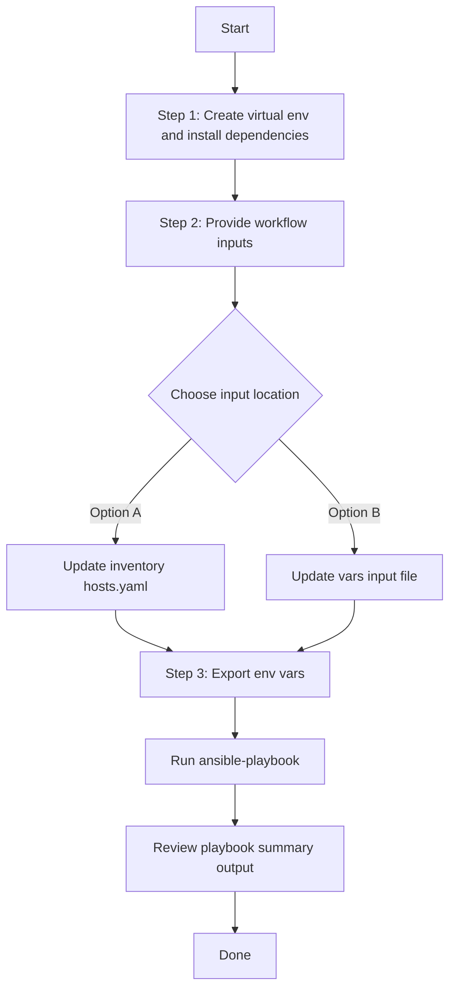

# Access Point Config Generator

## Table of Contents

- [User Flow (3 Steps)](#user-flow-3-steps)
- [Overview](#overview)
- [Features](#features)
- [Prerequisites](#prerequisites)
- [Workflow Structure](#workflow-structure)
- [Schema Parameters](#schema-parameters)
- [Getting Started](#getting-started)
- [Operations](#operations)
- [Examples](#examples)

## Overview

The Access Point config generator automates YAML playbook generation for existing access point configurations in Cisco Catalyst Center. It generates output compatible with `accesspoint_workflow_manager`.

---

## Features

- **Configuration Generation**: Generate YAML configurations compatible with `accesspoint_workflow_manager`.
  - Extract configured and provisioned AP settings from Catalyst Center.
  - Convert API responses into workflow-manager-ready YAML.
  - Reuse generated files for backup and migration.
- **Global Filtering**: Filter by site hierarchies, provisioned AP hostnames, AP config hostnames, combined provision/config hostnames, and MAC addresses.
- **Priority-based Selection**: Module applies highest-priority filter when multiple are provided.
- **Flexible Output**: Supports custom `file_path` and `file_mode` (`overwrite` / `append`).
- **Brownfield Discovery**: Omit `config` (or use workflow convenience flag) to generate all AP configurations.

---

## Prerequisites

### Software Requirements

| Component | Version |
|-----------|---------|
| Ansible | 2.13+ |
| cisco.catalystcenter collection | 2.6.0 |
| Python | 3.9+ |
| Cisco Catalyst Center | 2.3.5.3+ |
| catalystcentersdk | 2.10.10+ |

### Required Collections

```bash
ansible-galaxy collection install cisco.catalystcenter
ansible-galaxy collection install ansible.utils
pip install catalystcentersdk
pip install yamale
```

### Access Requirements

- Catalyst Center credentials with AP and site API access
- Network connectivity to Catalyst Center
- Existing AP data for targeted export use cases

---

## Workflow Structure

```
accesspoint_config_generator/
├── playbook/
│   └── accesspoint_config_generator.yml             # Main operations
├── vars/
│   └── accesspoint_config_inputs.yml                # Input examples
├── schema/
│   └── accesspoint_config_schema.yml                # Input validation
└── README.md
```

---

## Schema Parameters

### Basic Configuration

| Parameter | Type | Required | Default | Description |
|-----------|------|----------|---------|-------------|
| `generate_all_configurations` | boolean | No | false | Workflow convenience flag. When true, the playbook omits module `config` |
| `file_path` | string | No | auto-generated | Output file path for generated YAML |
| `file_mode` | string | No | `overwrite` | File write mode: `overwrite` or `append` |
| `global_filters` | dict | No | omitted | Workflow convenience wrapper mapped to module `config.global_filters` |

### Global Filters

- `site_list`
- `provision_hostname_list`
- `accesspoint_config_list`
- `accesspoint_provision_config_list`
- `accesspoint_provision_config_mac_list`

Module filter priority:
- `site_list` > `provision_hostname_list` > `accesspoint_config_list` > `accesspoint_provision_config_list` > `accesspoint_provision_config_mac_list`

---

## Getting Started

## Workflow Steps
## User Flow (3 Steps)



### Installation and Run (Aligned)

1. Create and activate a Python virtual environment, then install dependencies.

```bash
python3 -m venv .venv
source .venv/bin/activate
pip install -r requirements.txt
ansible-galaxy collection install cisco.catalystcenter --force
```

2. Provide workflow inputs in either inventory (`inventory/demo_lab/hosts.yaml`) or the workflow `vars/` file.

3. Export Catalyst Center environment variables and run the playbook.

```bash
export HOSTIP=<catalyst-center-ip-or-fqdn>
export CATALYST_CENTER_USERNAME=<username>
export CATALYST_CENTER_PASSWORD='<password>'
ansible-playbook -i ./inventory/demo_lab/hosts.yaml ./cvp/accesspoint_config_generator/playbook/accesspoint_config_generator.yml -vvvv
```


## Operations

### Generate Operations (state: gathered)

1. **Generate all AP configurations**
- Set `generate_all_configurations: true`, or omit `global_filters` entirely.

2. **Generate by site list**
- Use `global_filters.site_list`.

3. **Generate by AP hostname filters**
- Use `global_filters.provision_hostname_list` or `global_filters.accesspoint_config_list`.

4. **Generate by combined hostname/MAC filters**
- Use `global_filters.accesspoint_provision_config_list` or `global_filters.accesspoint_provision_config_mac_list`.

---

## Examples

### Example 1: Generate all AP configurations

```yaml
accesspoint_config:
  - generate_all_configurations: true
    file_path: "/tmp/accesspoint_complete_config.yml"
```

### Example 2: Filter by provisioned AP hostnames

```yaml
accesspoint_config:
  - file_path: "/tmp/accesspoint_by_provision_hostname.yml"
    global_filters:
      provision_hostname_list: ["test_ap_1", "test_ap_2"]
```

### Example 3: Filter by AP MAC addresses

```yaml
accesspoint_config:
  - file_path: "/tmp/accesspoint_by_mac.yml"
    global_filters:
      accesspoint_provision_config_mac_list: ["a4:88:73:d4:dd:80"]
```

---

## Notes

- `accesspoint_playbook_config_generator` expects `config.global_filters` when filtering is used.
- This workflow omits module `config` when `generate_all_configurations: true` is set or when `global_filters` is omitted or empty.
