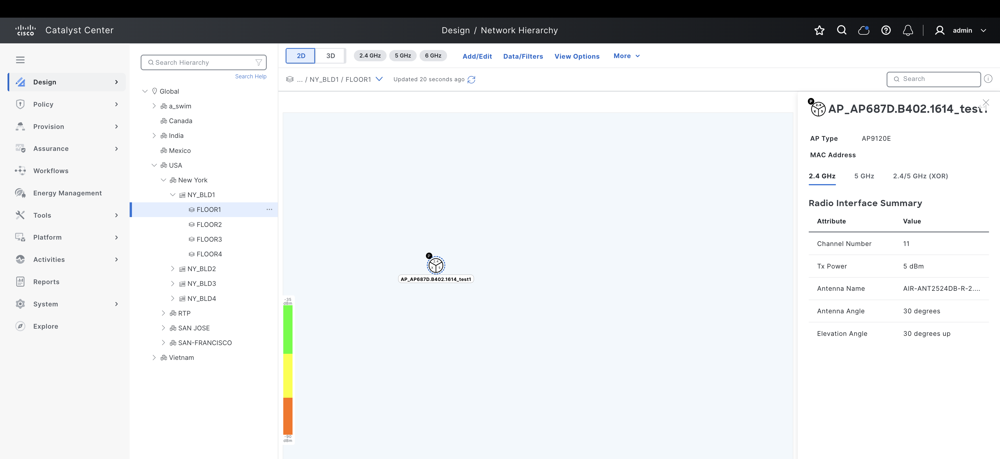
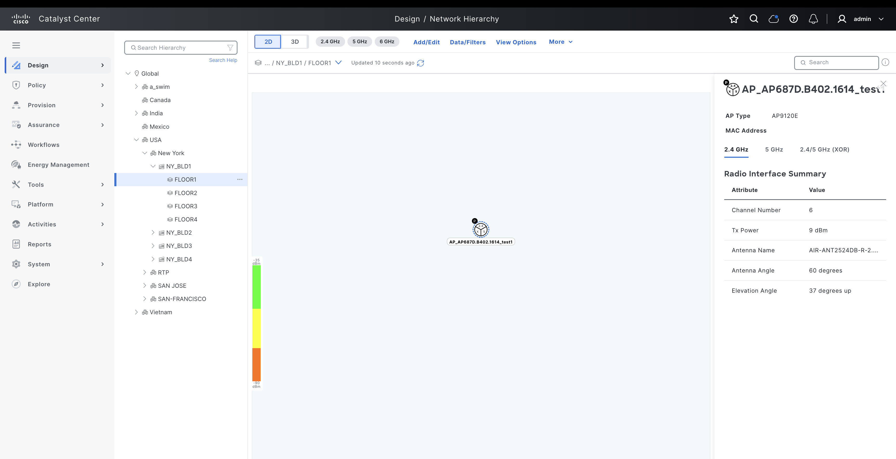

# Ansible Role: accesspoint_location

This role manages Access Point Location in Cisco Catalyst Center using the `accesspoint_location_workflow_manager` module.

## Summary

Resource module for managing Access Point planned positions and real positions in Cisco Catalyst Center.

## Requirements

- `cisco.catalystcenter` collection installed
- Catalyst Center SDK >= 3.1.3.0.0
- Python >= 3.9

## Role Variables

### Connection Variables
- `catalystcenter_host`: Catalyst Center hostname or IP address (required)
- `catalystcenter_username`: Username for authentication (required)
- `catalystcenter_password`: Password for authentication (required)
- `catalystcenter_verify`: SSL certificate verification (default: `false`)
- `catalystcenter_port`: API port (default: `443`)
- `catalystcenter_version`: Catalyst Center version (default: `2.3.7.6`)
- `catalystcenter_debug`: Enable debug mode (default: `false`)
- `catalystcenter_log_level`: Logging level (default: `INFO`)
- `catalystcenter_log`: Enable logging (default: `false`)

### Role-Specific Variables
- `accesspoint_location_config_verify` set to `True` to enable configuration verification on Cisco Catalyst Center after applying the playbook configuration. This ensures that the system validates the configuration state after the changes are applied. Default: `false`.
- `accesspoint_location_state` specifies the desired state for the configuration. If set to `merged`, the module will create or update the configuration by adding new settings or modifying existing ones. If set to `deleted`, the module will remove the specified settings. Choices: `merged`, `deleted`. Default: `merged`.
- `accesspoint_location_config` a list containing the details required for creating, updating or removing the Access Point planned and real positions. Default: `[]`.

## Dependencies

None

## Example Playbook

```yaml
- hosts: localhost
  roles:
    - role: accesspoint_location
      vars:
        catalystcenter_host: "{{ vault_catalystcenter_host }}"
        catalystcenter_username: "{{ vault_catalystcenter_username }}"
        catalystcenter_password: "{{ vault_catalystcenter_password }}"
        accesspoint_location_config: []
```

<!-- BEGIN WORKFLOW README ENHANCEMENTS -->
## Workflow Documentation Reference

These examples are adapted from the workflow documentation and example assets in `workflows/access_point_location`.

- Source README: `workflows/access_point_location/README.md`
- Source playbook: `workflows/access_point_location/playbook/access_point_location_playbook.yml`
- Source vars example: `workflows/access_point_location/vars/access_point_location_inputs.yml`
- Source schema: `workflows/access_point_location/schema/access_point_location_schema.yml`

## Visual Reference

The following image is copied from the workflow documentation to help map the role inputs to the Catalyst Center UI or expected output.



## Adapted Examples

### Example 1: Access Point Location

```yaml
- hosts: localhost
  roles:
    - role: accesspoint_location
      vars:
        catalystcenter_host: "{{ vault_catalystcenter_host }}"
        catalystcenter_username: "{{ vault_catalystcenter_username }}"
        catalystcenter_password: "{{ vault_catalystcenter_password }}"
        accesspoint_location_state: "merged"
        accesspoint_location_config:
        - floor_site_hierarchy: Global/USA/New York/NY_BLD1/FLOOR1
          access_points:
          - accesspoint_name: AP_AP687D.B402.1614_test1
            accesspoint_model: AP9120E
            position:
              x_position: 30
              y_position: 30
              z_position: 8
            radios:
            - bands:
              - '2.4'
              channel: 11
              tx_power: 5
              antenna:
                antenna_name: AIR-ANT2524DB-R-2.4GHz
                azimuth: 30
                elevation: 30
            - bands:
              - '5'
              channel: 44
              tx_power: 6
              antenna:
                antenna_name: AIR-ANT2524DB-R-5GHz
                azimuth: 35
                elevation: 30
        - floor_site_hierarchy: Global/USA/New York/NY_BLD1/FLOOR1
          access_points:
          - accesspoint_name: AP_AP687D.B402.1614_test1
            accesspoint_model: AP9120E
            position:
              x_position: 50
              y_position: 30
              z_position: 3.5
            radios:
            - bands:
              - '2.4'
              channel: 6
              tx_power: 9
              antenna:
                antenna_name: AIR-ANT2524DB-R-2.4GHz
                azimuth: 60
                elevation: 37
            - bands:
              - '5'
              channel: 48
              tx_power: 6
              antenna:
                antenna_name: AIR-ANT2524DB-R-5GHz
                azimuth: 77
                elevation: 30
```

<!-- END WORKFLOW README ENHANCEMENTS -->

## License

GPL-3.0-or-later

## Author Information

Cisco Systems
