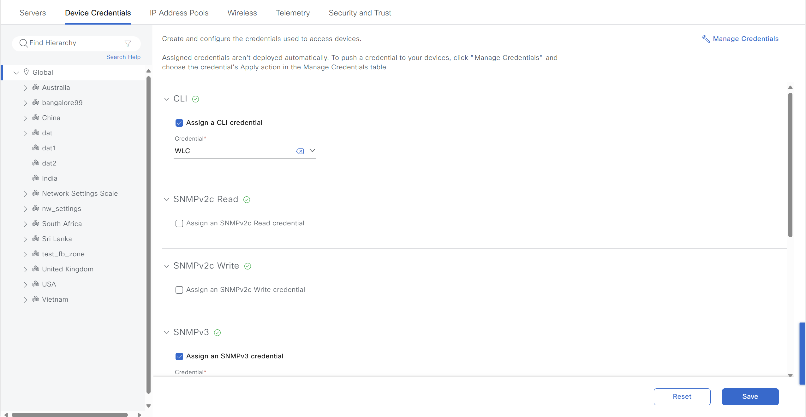
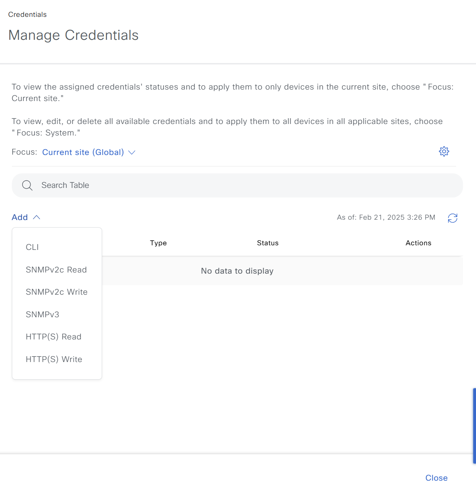

# Ansible Role: device_credential

This role manages Device Credentials in Cisco Catalyst Center using the `device_credential_workflow_manager` module.

## Requirements

- `cisco.catalystcenter` collection installed
- Catalyst Center SDK >= 3.1.3.0.0
- Python >= 3.9

## Role Variables

### Connection Variables
- `catalystcenter_host`: Catalyst Center hostname or IP address (required)
- `catalystcenter_username`: Username for authentication (required)
- `catalystcenter_password`: Password for authentication (required)
- `catalystcenter_verify`: SSL certificate verification (default: `false`)
- `catalystcenter_port`: API port (default: `443`)
- `catalystcenter_version`: Catalyst Center version (default: `2.3.7.6`)
- `catalystcenter_debug`: Enable debug mode (default: `false`)
- `catalystcenter_log_level`: Logging level (default: `INFO`)
- `catalystcenter_log`: Enable logging (default: `false`)

### Role-Specific Variables
- `device_credential_state`: Desired state - `merged` or `deleted` (default: `merged`)
- `device_credential_config_verify`: Verify configuration after applying (default: `false`)
- `device_credential_config`: List of device credential configurations (required)

## Dependencies

None

## Example Playbook

```yaml
- hosts: catalystcenter
  roles:
    - role: device_credential
      vars:
        catalystcenter_host: "{{ vault_catalystcenter_host }}"
        catalystcenter_username: "{{ vault_catalystcenter_username }}"
        catalystcenter_password: "{{ vault_catalystcenter_password }}"
        device_credential_config:
          - credential_type: "CLI"
```

<!-- BEGIN WORKFLOW README ENHANCEMENTS -->
## Workflow Documentation Reference

These examples are adapted from the workflow documentation and example assets in `workflows/device_credentials`.

- Source README: `workflows/device_credentials/README.md`
- Source playbook: `workflows/device_credentials/playbook/device_credentials_playbook.yml`
- Source vars example: `workflows/device_credentials/vars/device_credentials_vars.yml`
- Source schema: `workflows/device_credentials/schema/device_credentials_schema.yml`

## Visual Reference

The following image is copied from the workflow documentation to help map the role inputs to the Catalyst Center UI or expected output.



## Adapted Examples

### Example 1: Credentials

```yaml
- hosts: localhost
  roles:
    - role: device_credential
      vars:
        catalystcenter_host: "{{ vault_catalystcenter_host }}"
        catalystcenter_username: "{{ vault_catalystcenter_username }}"
        catalystcenter_password: "{{ vault_catalystcenter_password }}"
        device_credential_state: "merged"
        device_credential_config:
        - global_credential_details:
            cli_credential:
            - description: Device Administrator
              username: netadmin1
              password: Lablab#123
              enable_password: Cisco#123
            - description: CLI Sample 1
              username: cli-1
              password: 5!meh
              enable_password: q4^t^
            snmp_v2c_read:
            - description: snmpRead-1
              read_community: '@123'
            snmp_v2c_write:
            - description: snmpWrite-1
              write_community: '#mea@'
            snmp_v3:
            - description: snmpV3 Sample 1
              auth_password: hp!x6px&#@2xi5
              auth_type: SHA
              snmp_mode: AUTHPRIV
              privacy_password: ai7tpci3j@*j5g
              privacy_type: AES128
              username: admin
            https_read:
            - description: httpsRead Sample 1
              username: admin
              password: 2!x88yvqz*7
              port: 443
            https_write:
            - description: httpsWrite Sample 1
              username: admin
              password: j@5wgm%s2g%
              port: 443
```

### Example 2: Credentials Site Assignment

```yaml
- hosts: localhost
  roles:
    - role: device_credential
      vars:
        catalystcenter_host: "{{ vault_catalystcenter_host }}"
        catalystcenter_username: "{{ vault_catalystcenter_username }}"
        catalystcenter_password: "{{ vault_catalystcenter_password }}"
        device_credential_state: "merged"
        device_credential_config:
        - assign_credentials_to_site:
            cli_credential:
              description: CLI Sample 1
              username: cli-1
            snmp_v3:
              description: snmpV3 Sample 1
              username: admin
            https_read:
              username: admin
              description: httpsRead Sample 1
            https_write:
              username: admin
              description: httpsWrite Sample 1
            site_name:
            - Global/India
            - Global/India/Bangalore
```

<!-- END WORKFLOW README ENHANCEMENTS -->

## License

GPL-3.0-or-later

## Author Information

Cisco Systems
