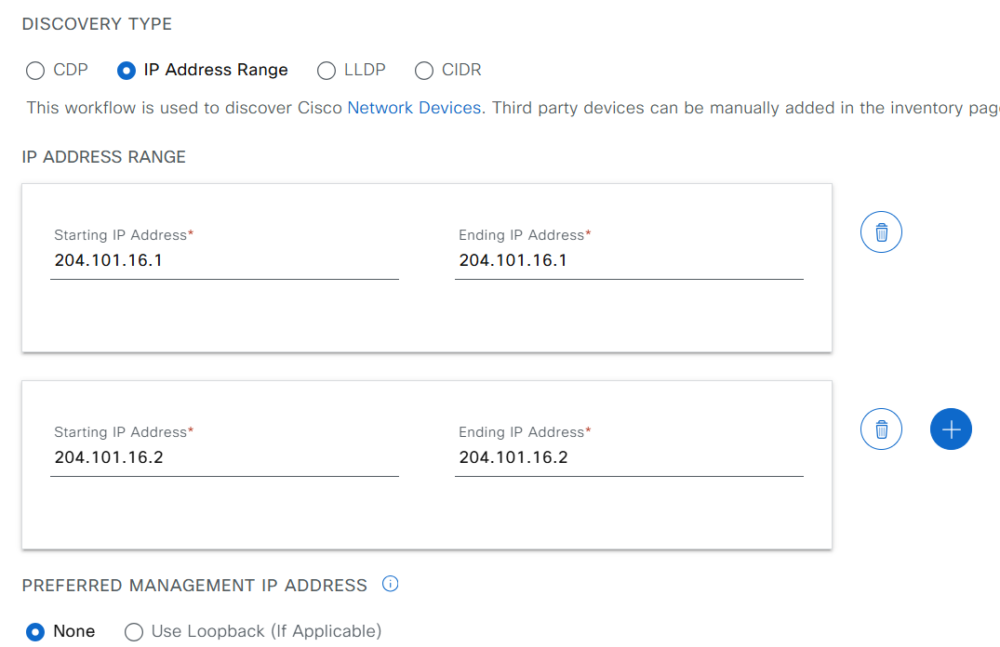
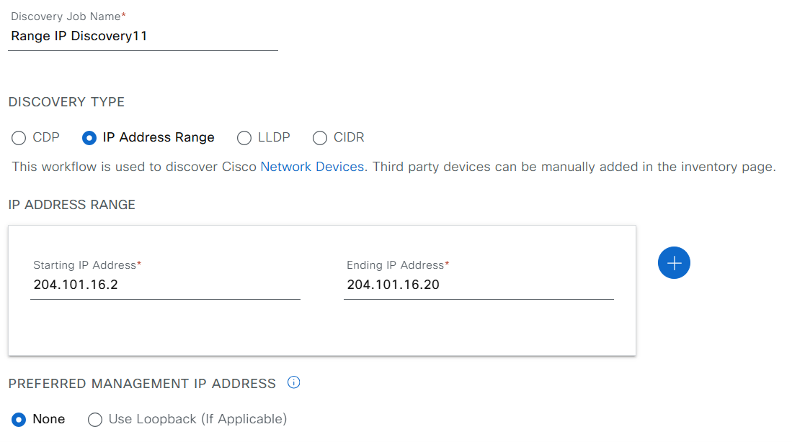

# Ansible Role: discovery

This role manages Discovery configurations in Cisco Catalyst Center using the `discovery_workflow_manager` module.

## Requirements

- `cisco.catalystcenter` collection installed
- Catalyst Center SDK >= 3.1.3.0.0
- Python >= 3.9

## Role Variables

### Connection Variables
- `catalystcenter_host`: Catalyst Center hostname or IP address (required)
- `catalystcenter_username`: Username for authentication (required)
- `catalystcenter_password`: Password for authentication (required)
- `catalystcenter_verify`: SSL certificate verification (default: `false`)
- `catalystcenter_port`: API port (default: `443`)
- `catalystcenter_version`: Catalyst Center version (default: `2.3.7.6`)
- `catalystcenter_debug`: Enable debug mode (default: `false`)
- `catalystcenter_log_level`: Logging level (default: `INFO`)
- `catalystcenter_log`: Enable logging (default: `false`)

### Role-Specific Variables
- `discovery_state`: Desired state - `merged` or `deleted` (default: `merged`)
- `discovery_config_verify`: Verify configuration after applying (default: `false`)
- `discovery_config`: List of discovery configurations (required)

## Dependencies

None

## Example Playbook

```yaml
- hosts: catalystcenter
  roles:
    - role: discovery
      vars:
        catalystcenter_host: "{{ vault_catalystcenter_host }}"
        catalystcenter_username: "{{ vault_catalystcenter_username }}"
        catalystcenter_password: "{{ vault_catalystcenter_password }}"
        discovery_config:
          - discovery_name: "Discovery-01"
            ip_address_list: "10.0.0.0/24"
```

<!-- BEGIN WORKFLOW README ENHANCEMENTS -->
## Workflow Documentation Reference

These examples are adapted from the workflow documentation and example assets in `workflows/device_discovery`.

- Source README: `workflows/device_discovery/README.md`
- Source playbook: `workflows/device_discovery/playbook/device_discovery_playbook.yml`
- Source vars example: `workflows/device_discovery/vars/device_discovery_vars.yml`
- Source schema: `workflows/device_discovery/schema/device_discovery_schema.yml`

## Visual Reference

The following image is copied from the workflow documentation to help map the role inputs to the Catalyst Center UI or expected output.



## Adapted Examples

### Example 1: Discovery

```yaml
- hosts: localhost
  roles:
    - role: discovery
      vars:
        catalystcenter_host: "{{ vault_catalystcenter_host }}"
        catalystcenter_username: "{{ vault_catalystcenter_username }}"
        catalystcenter_password: "{{ vault_catalystcenter_password }}"
        discovery_state: "merged"
        discovery_config:
          cdp:
          - ip_address_list:
            - 204.101.16.1
            devices_list: []
            discovery_type: CDP
            protocol_order: ssh
            discovery_name: CDP Based Discovery1
            discovery_specific_credentials:
              net_conf_port: '830'
            retry: 2
          single:
          - ip_address_list:
            - 204.101.16.1
            devices_list: []
            discovery_type: SINGLE
            protocol_order: ssh
            discovery_name: Single IP Discovery11
            discovery_specific_credentials:
              cli_credentials_list:
              - username: wlcaccess
                password: Lablab#123
                enable_password: Cisco#123
              - username: cisco
                password: Cisco#123
                enable_password: Cisco#123
              http_read_credential:
                username: wlcaccess
                password: Lablab#123
                port: 443
                secure: true
              http_write_credential:
                username: wlcaccess
                password: Lablab#123
                port: 443
                secure: true
              snmp_v2_read_credential:
                description: snmpV2 Sample 1
                community: public
              snmp_v2_write_credential:
                description: snmpV2 Sample 1
                community: public
              net_conf_port: '830'
            retry: 2
          - ip_address_list:
            - 204.101.16.2
            devices_list: []
            discovery_type: SINGLE
            protocol_order: ssh
            discovery_name: Single IP Discovery11
            discovery_specific_credentials:
              cli_credentials_list:
              - username: wlcaccess
                password: Lablab#123
                enable_password: Cisco#123
              - username: cisco
                password: Cisco#123
                enable_password: Cisco#123
              http_read_credential:
                username: wlcaccess
                password: Lablab#123
                port: 443
                secure: true
              http_write_credential:
                username: wlcaccess
                password: Lablab#123
                port: 443
                secure: true
              snmp_v3_credential:
                description: snmpv3Credentials
                username: wlcaccess
                snmp_mode: AUTHPRIV
                auth_password: Lablab#123
                auth_type: SHA
                privacy_type: AES128
                privacy_password: Lablab#123
              net_conf_port: '830'
            retry: 2
          range:
          - ip_address_list:
            - 204.101.16.2-204.101.16.2
            discovery_type: RANGE
            protocol_order: ssh
            discovery_name: Range IP Discovery11
            discovery_specific_credentials:
              cli_credentials_list:
              - username: wlcaccess
                password: Lablab#123
                enable_password: Cisco#123
              - username: cisco
                password: Cisco#123
                enable_password: Cisco#123
              http_read_credential:
                username: wlcaccess
                password: Lablab#123
                port: 443
                secure: true
              http_write_credential:
                username: wlcaccess
                password: Lablab#123
                port: 443
                secure: true
              snmp_v3_credential:
                description: snmpV3 Sample 1
                username: wlcaccess
                snmp_mode: AUTHPRIV
                auth_password: Lablab#123
                auth_type: SHA
                privacy_type: AES128
                privacy_password: Lablab#123
              net_conf_port: '830'
            retry: 2
          multi_range:
          - ip_address_list:
            - 204.101.16.2-204.101.16.3
            - 204.101.16.4-204.101.16.4
            discovery_type: MULTI RANGE
            protocol_order: ssh
            discovery_name: Multi Range Discovery 11
            discovery_specific_credentials:
              cli_credentials_list:
              - username: wlcaccess
                password: Lablab#123
                enable_password: Cisco#123
              - username: cisco
                password: Cisco#123
                enable_password: Cisco#123
              http_read_credential:
                username: wlcaccess
                password: Lablab#123
                port: 443
                secure: true
              http_write_credential:
                username: wlcaccess
                password: Lablab#123
                port: 443
                secure: true
              snmp_v3_credential:
                description: snmpV3 Sample 1
                username: wlcaccess
                snmp_mode: AUTHPRIV
                auth_password: Lablab#123
                auth_type: SHA
                privacy_type: AES128
                privacy_password: Lablab#123
              net_conf_port: '830'
            timeout: 30
            retry: 2
```

<!-- END WORKFLOW README ENHANCEMENTS -->

## License

GPL-3.0-or-later

## Author Information

Cisco Systems
