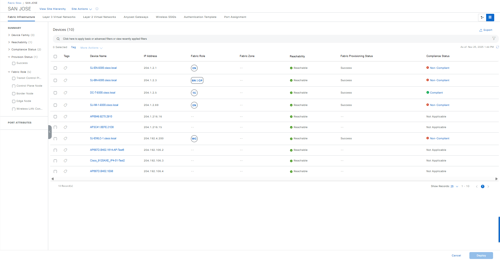

# Ansible Role: fabric_devices_info

This role manages Fabric Devices Info in Cisco Catalyst Center using the `fabric_devices_info_workflow_manager` module.

## Summary

Comprehensive fabric device information gathering module for Cisco Catalyst Center with advanced filtering and output capabilities.

## Requirements

- `cisco.catalystcenter` collection installed
- Catalyst Center SDK >= 3.1.3.0.0
- Python >= 3.9

## Role Variables

### Connection Variables
- `catalystcenter_host`: Catalyst Center hostname or IP address (required)
- `catalystcenter_username`: Username for authentication (required)
- `catalystcenter_password`: Password for authentication (required)
- `catalystcenter_verify`: SSL certificate verification (default: `false`)
- `catalystcenter_port`: API port (default: `443`)
- `catalystcenter_version`: Catalyst Center version (default: `2.3.7.6`)
- `catalystcenter_debug`: Enable debug mode (default: `false`)
- `catalystcenter_log_level`: Logging level (default: `INFO`)
- `catalystcenter_log`: Enable logging (default: `false`)

### Role-Specific Variables
- `fabric_devices_info_config_verify` set to true to verify the Cisco Catalyst Center after applying the playbook config. Default: `false`.
- `fabric_devices_info_state` the desired state of the configuration after module execution. Choices: `gathered`. Default: `gathered`.
- `fabric_devices_info_config` list of dictionaries specifying fabric device query parameters. Default: `[]`.

## Dependencies

None

## Example Playbook

```yaml
- hosts: localhost
  roles:
    - role: fabric_devices_info
      vars:
        catalystcenter_host: "{{ vault_catalystcenter_host }}"
        catalystcenter_username: "{{ vault_catalystcenter_username }}"
        catalystcenter_password: "{{ vault_catalystcenter_password }}"
        fabric_devices_info_config: []
```

<!-- BEGIN WORKFLOW README ENHANCEMENTS -->
## Workflow Documentation Reference

These examples are adapted from the workflow documentation and example assets in `workflows/fabric_devices_info`.

- Source README: `workflows/fabric_devices_info/README.md`
- Source playbook: `workflows/fabric_devices_info/playbook/fabric_devices_info_playbook.yml`
- Source vars example: `workflows/fabric_devices_info/vars/fabric_devices_info_input.yml`
- Source schema: `workflows/fabric_devices_info/schema/fabric_devices_info_schema.yml`

## Visual Reference

The following image is copied from the workflow documentation to help map the role inputs to the Catalyst Center UI or expected output.


## Adapted Examples

### Example 1: Fabric Device Info

```yaml
- hosts: localhost
  roles:
    - role: fabric_devices_info
      vars:
        catalystcenter_host: "{{ vault_catalystcenter_host }}"
        catalystcenter_username: "{{ vault_catalystcenter_username }}"
        catalystcenter_password: "{{ vault_catalystcenter_password }}"
        fabric_devices_info_state: "gathered"
        fabric_devices_info_config:
        - fabric_devices:
          - fabric_site_hierarchy: Global/USA/San Jose/Building23/Floor1
            fabric_device_role: CONTROL_PLANE_NODE
            device_identifier:
            - ip_address:
              - 204.1.2.2
              - 204.1.2.3
            - serial_number:
              - FJC272121AG
              - FJC272121AH
            timeout: 120
            retries: 3
            interval: 10
            requested_info:
            - fabric_info
            - handoff_info
            - onboarding_info
            - connected_devices_info
            output_file_info:
              file_path: /tmp/fabric_devices/control_plane_info
              file_format: yaml
              file_mode: w
              timestamp: true
        - fabric_devices:
          - fabric_site_hierarchy: Global/USA/San Jose/Building23
            fabric_device_role: BORDER_NODE
            device_identifier:
            - ip_address_range: 192.168.1.1-192.168.1.50
            timeout: 180
            retries: 5
            interval: 15
            requested_info:
            - fabric_info
            - handoff_info
            output_file_info:
              file_path: /tmp/fabric_devices/border_node_handoffs
              file_format: json
              file_mode: a
              timestamp: true
```

<!-- END WORKFLOW README ENHANCEMENTS -->

## License

GPL-3.0-or-later

## Author Information

Cisco Systems
