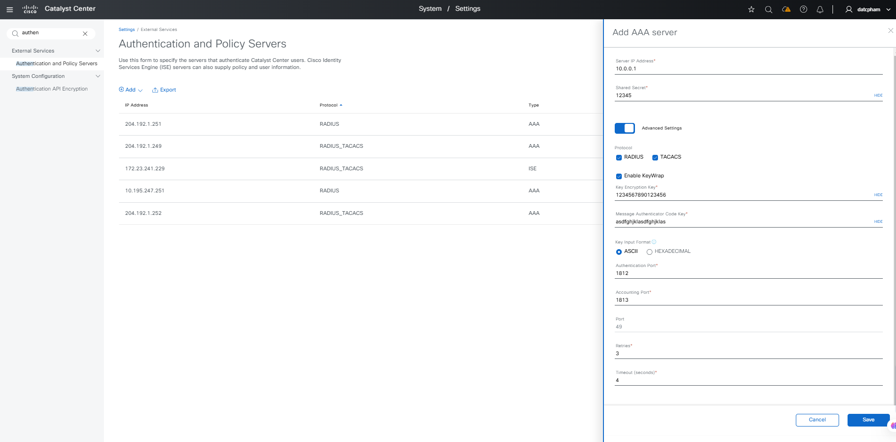
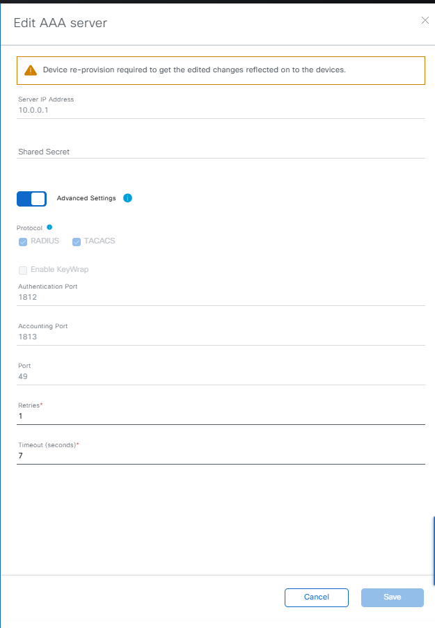

# Ansible Role: ise_radius_integration

This role manages ISE RADIUS Integration in Cisco Catalyst Center using the `ise_radius_integration_workflow_manager` module.

## Requirements

- `cisco.catalystcenter` collection installed
- Catalyst Center SDK >= 3.1.3.0.0
- Python >= 3.9

## Role Variables

### Connection Variables
- `catalystcenter_host`: Catalyst Center hostname or IP address (required)
- `catalystcenter_username`: Username for authentication (required)
- `catalystcenter_password`: Password for authentication (required)
- `catalystcenter_verify`: SSL certificate verification (default: `false`)
- `catalystcenter_port`: API port (default: `443`)
- `catalystcenter_version`: Catalyst Center version (default: `2.3.7.6`)
- `catalystcenter_debug`: Enable debug mode (default: `false`)
- `catalystcenter_log_level`: Logging level (default: `INFO`)
- `catalystcenter_log`: Enable logging (default: `false`)

### Role-Specific Variables
- `ise_radius_integration_state`: Desired state - `merged` or `deleted` (default: `merged`)
- `ise_radius_integration_config_verify`: Verify configuration after applying (default: `false`)
- `ise_radius_integration_config`: List of ISE RADIUS integration configurations (required)

## Dependencies

None

## Example Playbook

```yaml
- hosts: catalystcenter
  roles:
    - role: ise_radius_integration
      vars:
        catalystcenter_host: "{{ vault_catalystcenter_host }}"
        catalystcenter_username: "{{ vault_catalystcenter_username }}"
        catalystcenter_password: "{{ vault_catalystcenter_password }}"
        ise_radius_integration_config:
          - ise_ip: "10.0.0.10"
```

<!-- BEGIN WORKFLOW README ENHANCEMENTS -->
## Workflow Documentation Reference

These examples are adapted from the workflow documentation and example assets in `workflows/ise_radius_integration`.

- Source README: `workflows/ise_radius_integration/README.md`
- Source playbook: `workflows/ise_radius_integration/playbook/ise_radius_integration_workflow_playbook.yml`
- Source vars example: `workflows/ise_radius_integration/vars/ise_radius_integration_workflow_input.yml`
- Source schema: `workflows/ise_radius_integration/schema/ise_radius_integration_workflow_schema.yml`

## Visual Reference

The following image is copied from the workflow documentation to help map the role inputs to the Catalyst Center UI or expected output.



## Adapted Examples

### Example 1: ISE Radius Integration

```yaml
- hosts: localhost
  roles:
    - role: ise_radius_integration
      vars:
        catalystcenter_host: "{{ vault_catalystcenter_host }}"
        catalystcenter_username: "{{ vault_catalystcenter_username }}"
        catalystcenter_password: "{{ vault_catalystcenter_password }}"
        ise_radius_integration_state: "merged"
        ise_radius_integration_config:
        - authentication_policy_server:
          - server_type: AAA
            server_ip_address: 10.0.0.1
            shared_secret: '12345'
            protocol: RADIUS_TACACS
            authentication_port: 1812
            accounting_port: 1813
            retries: 3
            timeout: 4
            role: secondary
          - server_type: ISE
            server_ip_address: 10.195.243.31
            shared_secret: Labab123
            protocol: RADIUS_TACACS
            authentication_port: 1812
            accounting_port: 1813
            retries: 3
            timeout: 4
            role: primary
            use_dnac_cert_for_pxgrid: false
            pxgrid_enabled: true
            cisco_ise_dtos:
            - user_name: admin
              password: Maglev#123
              fqdn: IBSTE-ISE1.cisco.com
              ip_address: 10.195.243.31
              description: Cisco ISE
            trusted_server: true
            ise_integration_wait_time: 20
```

<!-- END WORKFLOW README ENHANCEMENTS -->

## License

GPL-3.0-or-later

## Author Information

Cisco Systems
