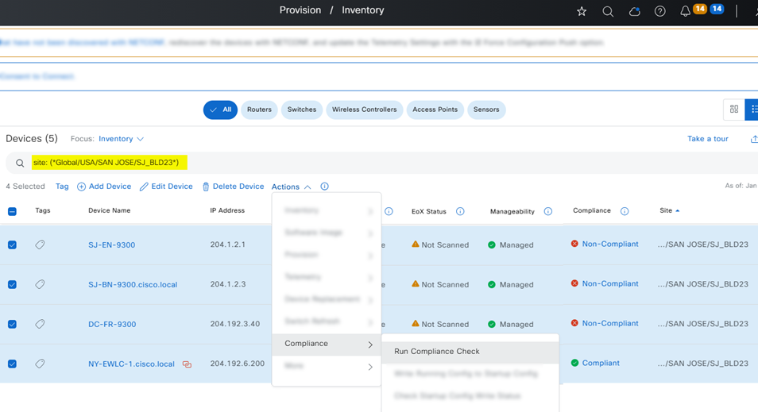

# Ansible Role: network_compliance

This role manages Network Compliance in Cisco Catalyst Center using the `network_compliance_workflow_manager` module.

## Requirements

- `cisco.catalystcenter` collection installed
- Catalyst Center SDK >= 3.1.3.0.0
- Python >= 3.9

## Role Variables

### Connection Variables
- `catalystcenter_host`: Catalyst Center hostname or IP address (required)
- `catalystcenter_username`: Username for authentication (required)
- `catalystcenter_password`: Password for authentication (required)
- `catalystcenter_verify`: SSL certificate verification (default: `false`)
- `catalystcenter_port`: API port (default: `443`)
- `catalystcenter_version`: Catalyst Center version (default: `2.3.7.6`)
- `catalystcenter_debug`: Enable debug mode (default: `false`)
- `catalystcenter_log_level`: Logging level (default: `INFO`)
- `catalystcenter_log`: Enable logging (default: `false`)

### Role-Specific Variables
- `network_compliance_state`: Desired state - `merged` or `deleted` (default: `merged`)
- `network_compliance_config_verify`: Verify configuration after applying (default: `false`)
- `network_compliance_config`: List of network compliance configurations (required)

## Dependencies

None

## Example Playbook

```yaml
- hosts: catalystcenter
  roles:
    - role: network_compliance
      vars:
        catalystcenter_host: "{{ vault_catalystcenter_host }}"
        catalystcenter_username: "{{ vault_catalystcenter_username }}"
        catalystcenter_password: "{{ vault_catalystcenter_password }}"
        network_compliance_config:
          - device_ip: "10.0.0.1"
```

<!-- BEGIN WORKFLOW README ENHANCEMENTS -->
## Workflow Documentation Reference

These examples are adapted from the workflow documentation and example assets in `workflows/network_compliance`.

- Source README: `workflows/network_compliance/README.md`
- Source playbook: `workflows/network_compliance/playbook/network_compliance_workflow_playbook.yml`
- Source vars example: `workflows/network_compliance/vars/network_compliance_workflow_input.yml`
- Source schema: `workflows/network_compliance/schema/network_compliance_workflow_schema.yml`

## Visual Reference

The following image is copied from the workflow documentation to help map the role inputs to the Catalyst Center UI or expected output.


## Adapted Examples

### Example 1: Network Compliance

```yaml
- hosts: localhost
  roles:
    - role: network_compliance
      vars:
        catalystcenter_host: "{{ vault_catalystcenter_host }}"
        catalystcenter_username: "{{ vault_catalystcenter_username }}"
        catalystcenter_password: "{{ vault_catalystcenter_password }}"
        network_compliance_state: "merged"
        network_compliance_config:
        - ip_address_list:
          - 204.1.2.2
          - 204.1.2.1
          - 204.1.2.3
          - 204.1.2.4
          site_name: Global/USA/SAN JOSE/BLD23
          run_compliance: true
          run_compliance_categories:
          - INTENT
          - RUNNING_CONFIG
          - IMAGE
          - PSIRT
          sync_device_config: true
```

<!-- END WORKFLOW README ENHANCEMENTS -->

## License

GPL-3.0-or-later

## Author Information

Cisco Systems
