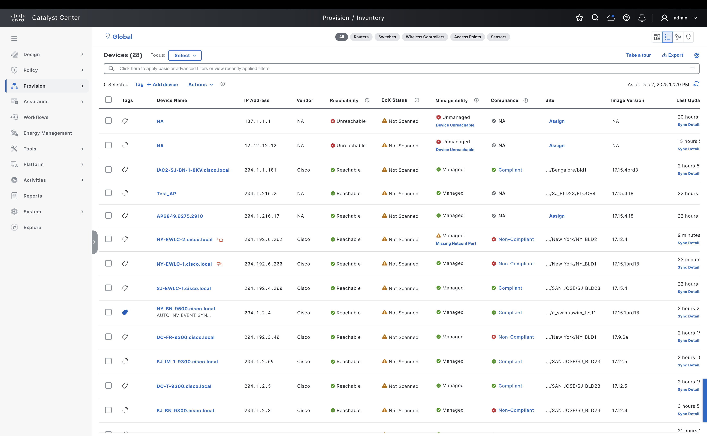

# Ansible Role: network_devices_info

This role manages Network Devices Info in Cisco Catalyst Center using the `network_devices_info_workflow_manager` module.

## Summary

Gather facts about network devices from Cisco Catalyst Center (facts/info module) using flexible filters.

## Requirements

- `cisco.catalystcenter` collection installed
- Catalyst Center SDK >= 3.1.3.0.0
- Python >= 3.9

## Role Variables

### Connection Variables
- `catalystcenter_host`: Catalyst Center hostname or IP address (required)
- `catalystcenter_username`: Username for authentication (required)
- `catalystcenter_password`: Password for authentication (required)
- `catalystcenter_verify`: SSL certificate verification (default: `false`)
- `catalystcenter_port`: API port (default: `443`)
- `catalystcenter_version`: Catalyst Center version (default: `2.3.7.6`)
- `catalystcenter_debug`: Enable debug mode (default: `false`)
- `catalystcenter_log_level`: Logging level (default: `INFO`)
- `catalystcenter_log`: Enable logging (default: `false`)

### Role-Specific Variables
- `network_devices_info_config_verify` set to True to verify the Cisco Catalyst Center after applying the playbook config. Default: `false`.
- `network_devices_info_state` the desired state of the configuration after module execution. Choices: `gathered`. Default: `gathered`.
- `network_devices_info_config` list of dictionaries specifying network device query parameters. Each dictionary must contain a C(network_devices) list with at least one unique identifier (such as management IP, MAC address, hostname, or serial number) per device. Default: `[]`.

## Dependencies

None

## Example Playbook

```yaml
- hosts: localhost
  roles:
    - role: network_devices_info
      vars:
        catalystcenter_host: "{{ vault_catalystcenter_host }}"
        catalystcenter_username: "{{ vault_catalystcenter_username }}"
        catalystcenter_password: "{{ vault_catalystcenter_password }}"
        network_devices_info_config: []
```

<!-- BEGIN WORKFLOW README ENHANCEMENTS -->
## Workflow Documentation Reference

These examples are adapted from the workflow documentation and example assets in `workflows/network_devices_info`.

- Source README: `workflows/network_devices_info/README.md`
- Source playbook: `workflows/network_devices_info/playbook/network_devices_info_playbook.yml`
- Source vars example: `workflows/network_devices_info/vars/network_devices_info_input.yml`
- Source schema: `workflows/network_devices_info/schema/network_devices_info_schema.yml`

## Visual Reference

The following image is copied from the workflow documentation to help map the role inputs to the Catalyst Center UI or expected output.


## Adapted Examples

### Example 1: Network Devices Info

```yaml
- hosts: localhost
  roles:
    - role: network_devices_info
      vars:
        catalystcenter_host: "{{ vault_catalystcenter_host }}"
        catalystcenter_username: "{{ vault_catalystcenter_username }}"
        catalystcenter_password: "{{ vault_catalystcenter_password }}"
        network_devices_info_state: "gathered"
        network_devices_info_config:
        - network_devices:
          - site_hierarchy: Global/USA/SAN JOSE/SJ_BLD23
            device_type: Cisco Catalyst 9300 Switch
            device_role: ACCESS
            device_family: Switches and Hubs
            os_type: IOS-XE
            device_identifier:
            - ip_address:
              - 204.1.2.69
              - 204.1.2.1
            timeout: 120
            retries: 3
            interval: 10
            requested_info:
            - all
            output_file_info:
              file_path: /tmp/network_devices_all_info
              file_format: json
              file_mode: w
              timestamp: true
        - network_devices:
          - device_family: Routers
            device_identifier:
            - serial_number:
              - FJC2402A0TX
            timeout: 60
            retries: 2
            interval: 5
            requested_info:
            - device_info
            - interface_info
            - interface_vlan_info
            output_file_info:
              file_path: /tmp/network_devices_basic_info
              file_format: yaml
              file_mode: w
              timestamp: false
```

<!-- END WORKFLOW README ENHANCEMENTS -->

## License

GPL-3.0-or-later

## Author Information

Cisco Systems
