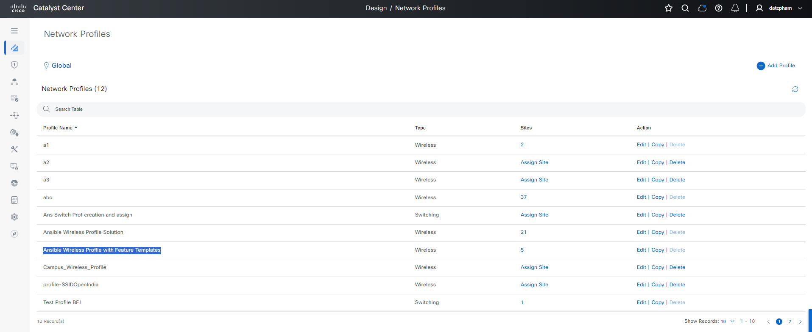
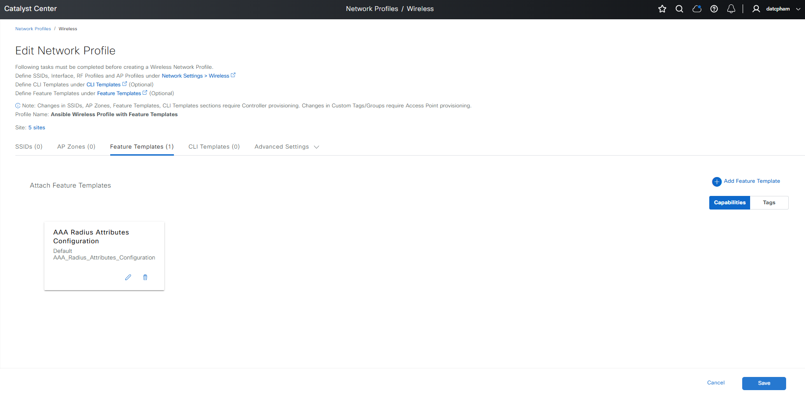

# Ansible Role: network_profile_wireless

This role manages Network Profile Wireless in Cisco Catalyst Center using the `network_profile_wireless_workflow_manager` module.

## Requirements

- `cisco.catalystcenter` collection installed
- Catalyst Center SDK >= 3.1.3.0.0
- Python >= 3.9

## Role Variables

### Connection Variables
- `catalystcenter_host`: Catalyst Center hostname or IP address (required)
- `catalystcenter_username`: Username for authentication (required)
- `catalystcenter_password`: Password for authentication (required)
- `catalystcenter_verify`: SSL certificate verification (default: `false`)
- `catalystcenter_port`: API port (default: `443`)
- `catalystcenter_version`: Catalyst Center version (default: `2.3.7.6`)
- `catalystcenter_debug`: Enable debug mode (default: `false`)
- `catalystcenter_log_level`: Logging level (default: `INFO`)
- `catalystcenter_log`: Enable logging (default: `false`)

### Role-Specific Variables
- `network_profile_wireless_state`: Desired state - `merged` or `deleted` (default: `merged`)
- `network_profile_wireless_config_verify`: Verify configuration after applying (default: `false`)
- `network_profile_wireless_config`: List of network profile wireless configurations (required)

## Dependencies

None

## Example Playbook

```yaml
- hosts: catalystcenter
  roles:
    - role: network_profile_wireless
      vars:
        catalystcenter_host: "{{ vault_catalystcenter_host }}"
        catalystcenter_username: "{{ vault_catalystcenter_username }}"
        catalystcenter_password: "{{ vault_catalystcenter_password }}"
        network_profile_wireless_config:
          - profile_name: "Wireless-Profile-01"
```

<!-- BEGIN WORKFLOW README ENHANCEMENTS -->
## Workflow Documentation Reference

These examples are adapted from the workflow documentation and example assets in `workflows/network_profile_wireless`.

- Source README: `workflows/network_profile_wireless/README.md`
- Source playbook: `workflows/network_profile_wireless/playbook/network_profile_wireless_playbook.yml`
- Source vars example: `workflows/network_profile_wireless/vars/network_profile_wireless_inputs.yml`
- Source schema: `workflows/network_profile_wireless/schema/network_profile_wireless_schema.yml`

## Visual Reference

The following image is copied from the workflow documentation to help map the role inputs to the Catalyst Center UI or expected output.



## Adapted Examples

### Example 1: Wireless Nw Profiles

```yaml
- hosts: localhost
  roles:
    - role: network_profile_wireless
      vars:
        catalystcenter_host: "{{ vault_catalystcenter_host }}"
        catalystcenter_username: "{{ vault_catalystcenter_username }}"
        catalystcenter_password: "{{ vault_catalystcenter_password }}"
        network_profile_wireless_state: "merged"
        network_profile_wireless_config:
        - profile_name: Corporate_Wireless_Profile
          site_names:
          - Global/USA/SAN JOSE
          - Global/USA/SAN-FRANCISCO
          ssid_details:
          - ssid_name: iac-open
            enable_fabric: true
          - ssid_name: iac-employees
            enable_fabric: true
          ap_zones:
          - ap_zone_name: HQ_AP_Zone
            rf_profile_name: HIGH
            ssids:
            - iac-open
          - ap_zone_name: Branch_AP_Zone
            rf_profile_name: TYPICAL
            ssids:
            - iac-guests
          additional_interfaces:
          - interface_name: Corp_Interface_1
            vlan_id: 100
          - interface_name: Guest_Interface_1
            vlan_id: 3002
```

<!-- END WORKFLOW README ENHANCEMENTS -->

## License

GPL-3.0-or-later

## Author Information

Cisco Systems
