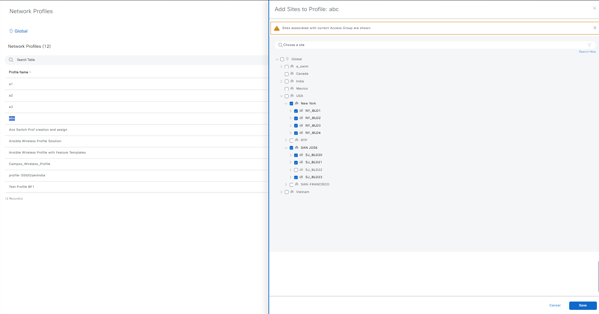
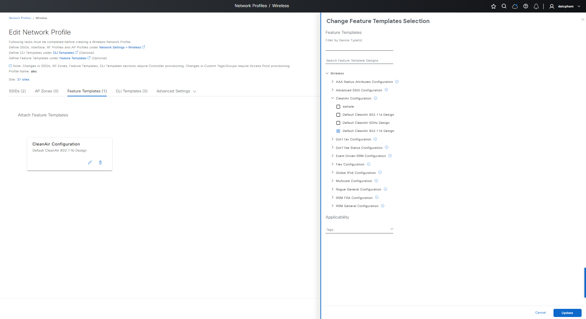

# Ansible Role: provision

This role manages Device Provisioning in Cisco Catalyst Center using the `provision_workflow_manager` module.

## Requirements

- `cisco.catalystcenter` collection installed
- Catalyst Center SDK >= 3.1.3.0.0
- Python >= 3.9

## Role Variables

### Connection Variables
- `catalystcenter_host`: Catalyst Center hostname or IP address (required)
- `catalystcenter_username`: Username for authentication (required)
- `catalystcenter_password`: Password for authentication (required)
- `catalystcenter_verify`: SSL certificate verification (default: `false`)
- `catalystcenter_port`: API port (default: `443`)
- `catalystcenter_version`: Catalyst Center version (default: `2.3.7.6`)
- `catalystcenter_debug`: Enable debug mode (default: `false`)
- `catalystcenter_log_level`: Logging level (default: `INFO`)
- `catalystcenter_log`: Enable logging (default: `false`)

### Role-Specific Variables
- `provision_state`: Desired state - `merged` or `deleted` (default: `merged`)
- `provision_config_verify`: Verify configuration after applying (default: `false`)
- `provision_config`: List of provisioning configurations (required)

## Dependencies

None

## Example Playbook

```yaml
- hosts: catalystcenter
  roles:
    - role: provision
      vars:
        catalystcenter_host: "{{ vault_catalystcenter_host }}"
        catalystcenter_username: "{{ vault_catalystcenter_username }}"
        catalystcenter_password: "{{ vault_catalystcenter_password }}"
        provision_config:
          - device_ip: "10.0.0.1"
            site_name: "Global/USA/Building1"
```

<!-- BEGIN WORKFLOW README ENHANCEMENTS -->
## Workflow Documentation Reference

These examples are adapted from the workflow documentation and example assets in `workflows/provision`.

- Source README: `workflows/provision/README.md`
- Source playbook: `workflows/provision/playbook/provision_workflow_playbook.yml`
- Source vars example: `workflows/provision/vars/provision_workflow_inputs.yml`
- Source schema: `workflows/provision/schema/provision_workflow_schema.yml`

## Visual Reference

The following image is copied from the workflow documentation to help map the role inputs to the Catalyst Center UI or expected output.



## Adapted Examples

### Example 1: Provision

```yaml
- hosts: localhost
  roles:
    - role: provision
      vars:
        catalystcenter_host: "{{ vault_catalystcenter_host }}"
        catalystcenter_username: "{{ vault_catalystcenter_username }}"
        catalystcenter_password: "{{ vault_catalystcenter_password }}"
        provision_state: "merged"
        provision_config:
        - site_name_hierarchy: Global/USA/SAN JOSE/SJ_BLD23
          management_ip_address: 204.1.2.5
        - site_name_hierarchy: Global/USA/SAN JOSE/SJ_BLD21
          management_ip_address: 137.1.4.103
```

<!-- END WORKFLOW README ENHANCEMENTS -->

## License

GPL-3.0-or-later

## Author Information

Cisco Systems
