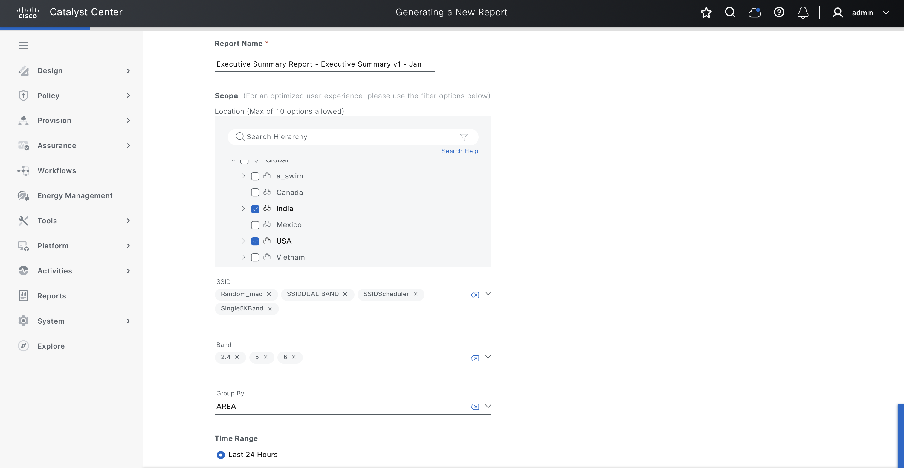
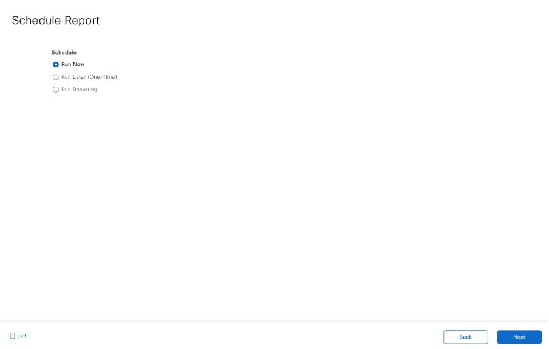

# Ansible Role: reports

This role manages Reports in Cisco Catalyst Center using the `reports_workflow_manager` module.

## Summary

Resource module for managing Reports in Cisco Catalyst Center.

## Requirements

- `cisco.catalystcenter` collection installed
- Catalyst Center SDK >= 3.1.3.0.0
- Python >= 3.9

## Role Variables

### Connection Variables
- `catalystcenter_host`: Catalyst Center hostname or IP address (required)
- `catalystcenter_username`: Username for authentication (required)
- `catalystcenter_password`: Password for authentication (required)
- `catalystcenter_verify`: SSL certificate verification (default: `false`)
- `catalystcenter_port`: API port (default: `443`)
- `catalystcenter_version`: Catalyst Center version (default: `2.3.7.6`)
- `catalystcenter_debug`: Enable debug mode (default: `false`)
- `catalystcenter_log_level`: Logging level (default: `INFO`)
- `catalystcenter_log`: Enable logging (default: `false`)

### Role-Specific Variables
- `reports_config_verify` set to C(True) to enable configuration verification on Cisco Catalyst Center after applying the playbook config. This will ensure that the system validates the configuration state after the change is applied. Default: `false`.
- `reports_state` specifies the desired state for the configuration. If C(merged), the module will create or schedule new reports. If C(deleted), the module will remove existing scheduled reports. Choices: `merged`, `deleted`. Default: `merged`.
- `reports_config` a list of configuration settings for generating reports in Cisco Catalyst Center. Each configuration defines report metadata, scheduling, delivery options, view selections, format, and applicable filters. Supports creating, scheduling, and downloading customized network reports across various data categories. Default: `[]`.

## Dependencies

None

## Example Playbook

```yaml
- hosts: localhost
  roles:
    - role: reports
      vars:
        catalystcenter_host: "{{ vault_catalystcenter_host }}"
        catalystcenter_username: "{{ vault_catalystcenter_username }}"
        catalystcenter_password: "{{ vault_catalystcenter_password }}"
        reports_config: []
```

<!-- BEGIN WORKFLOW README ENHANCEMENTS -->
## Workflow Documentation Reference

These examples are adapted from the workflow documentation and example assets in `workflows/reports`.

- Source README: `workflows/reports/README.md`
- Source playbook: `workflows/reports/playbook/reports_playbook.yml`
- Source vars example: `workflows/reports/vars/reports_input.yml`
- Source schema: `workflows/reports/schema/reports_schema.yml`

## Visual Reference

The following image is copied from the workflow documentation to help map the role inputs to the Catalyst Center UI or expected output.



## Adapted Examples

### Example 1: Reports

```yaml
- hosts: localhost
  roles:
    - role: reports
      vars:
        catalystcenter_host: "{{ vault_catalystcenter_host }}"
        catalystcenter_username: "{{ vault_catalystcenter_username }}"
        catalystcenter_password: "{{ vault_catalystcenter_password }}"
        reports_state: "merged"
        reports_config:
        - generate_report:
          - name: ExecutiveSummary_Report_PDF
            new_report: true
            view_group_name: Executive Summary
            deliveries:
            - delivery_type: NOTIFICATION
              notification_endpoints:
              - email_addresses:
                - mekandar@cisco.com
                - pbalaku2@cisco.com
              email_attach: true
              notify:
              - COMPLETED
            schedule:
              schedule_type: SCHEDULE_NOW
              time_zone: Asia/Calcutta
            view:
              view_name: Executive Summary
              field_groups: []
              format:
                format_type: PDF
              filters:
              - name: Location
                filter_type: MULTI_SELECT_TREE
                value:
                - value: Global/India
                - value: Global/USA
              - name: TimeRange
                filter_type: TIME_RANGE
                value:
                  time_range_option: LAST_24_HOURS
                  time_zone: Asia/Calcutta
        - generate_report:
          - name: SecurityAdvisories_module
            view_group_name: Security Advisories
            deliveries:
            - delivery_type: DOWNLOAD
            schedule:
              schedule_type: SCHEDULE_RECURRENCE
              date_time: 2026-12-25 03:00 PM
              time_zone: Asia/Calcutta
              recurrence:
                recurrence_type: WEEKLY
                days:
                - TUESDAY
                - WEDNESDAY
            view:
              view_name: Security Advisories Data
              field_groups:
              - field_group_name: psirtAllData
                field_group_display_name: All Security Advisory Data
                fields:
                - name: deviceName
                - name: deviceType
                - name: deviceSite
                - name: deviceIpAddress
              format:
                format_type: CSV
              filters:
              - name: DeviceType
                filter_type: MULTI_SELECT
                value:
                - value: Routers
                - value: Switches and Hubs
              - name: Location
                filter_type: MULTI_SELECT_TREE
                value:
                - value: Global
```

<!-- END WORKFLOW README ENHANCEMENTS -->

## License

GPL-3.0-or-later

## Author Information

Cisco Systems
