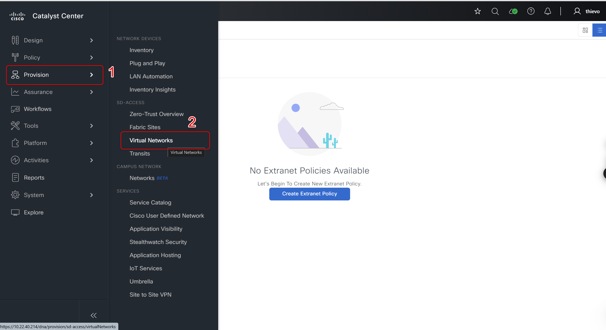
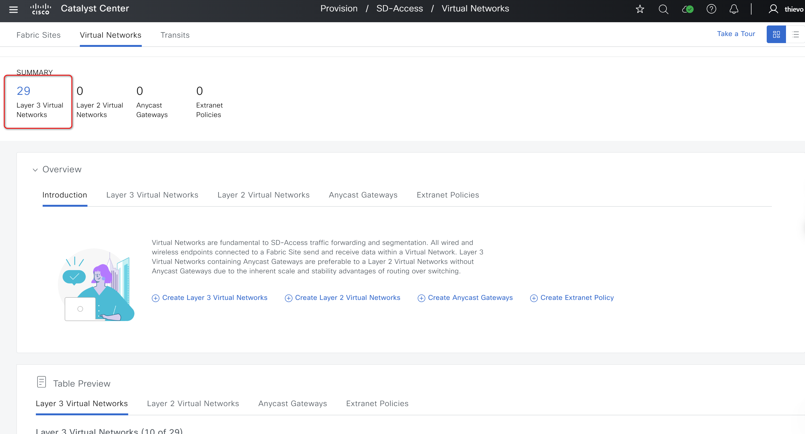

# Ansible Role: sda_extranet_policies

This role manages SDA Extranet Policies in Cisco Catalyst Center using the `sda_extranet_policies_workflow_manager` module.

## Requirements

- `cisco.catalystcenter` collection installed
- Catalyst Center SDK >= 3.1.3.0.0
- Python >= 3.9

## Role Variables

### Connection Variables
- `catalystcenter_host`: Catalyst Center hostname or IP address (required)
- `catalystcenter_username`: Username for authentication (required)
- `catalystcenter_password`: Password for authentication (required)
- `catalystcenter_verify`: SSL certificate verification (default: `false`)
- `catalystcenter_port`: API port (default: `443`)
- `catalystcenter_version`: Catalyst Center version (default: `2.3.7.6`)
- `catalystcenter_debug`: Enable debug mode (default: `false`)
- `catalystcenter_log_level`: Logging level (default: `INFO`)
- `catalystcenter_log`: Enable logging (default: `false`)

### Role-Specific Variables
- `sda_extranet_policies_state`: Desired state - `merged` or `deleted` (default: `merged`)
- `sda_extranet_policies_config_verify`: Verify configuration after applying (default: `false`)
- `sda_extranet_policies_config`: List of SDA extranet policies configurations (required)

## Dependencies

None

## Example Playbook

```yaml
- hosts: catalystcenter
  roles:
    - role: sda_extranet_policies
      vars:
        catalystcenter_host: "{{ vault_catalystcenter_host }}"
        catalystcenter_username: "{{ vault_catalystcenter_username }}"
        catalystcenter_password: "{{ vault_catalystcenter_password }}"
        sda_extranet_policies_config:
          - extranet_policy_name: "Extranet-Policy-01"
```

<!-- BEGIN WORKFLOW README ENHANCEMENTS -->
## Workflow Documentation Reference

These examples are adapted from the workflow documentation and example assets in `workflows/sda_fabric_extranet_policy`.

- Source README: `workflows/sda_fabric_extranet_policy/README.md`
- Source playbook: `workflows/sda_fabric_extranet_policy/playbook/fabric_extranet_policy_playbook.yml`
- Source vars example: `workflows/sda_fabric_extranet_policy/vars/fabric_extranet_policy_inputs.yml`
- Source schema: `workflows/sda_fabric_extranet_policy/schema/fabric_extranet_policy_schema.yml`

## Visual Reference

The following image is copied from the workflow documentation to help map the role inputs to the Catalyst Center UI or expected output.



## Adapted Examples

### Example 1: Extranet Policies

```yaml
- hosts: localhost
  roles:
    - role: sda_extranet_policies
      vars:
        catalystcenter_host: "{{ vault_catalystcenter_host }}"
        catalystcenter_username: "{{ vault_catalystcenter_username }}"
        catalystcenter_password: "{{ vault_catalystcenter_password }}"
        sda_extranet_policies_state: "merged"
        sda_extranet_policies_config:
        - extranet_policy_name: ex_policy_infra_vn_provider
          provider_virtual_network: INFRA VN
          subscriber_virtual_networks:
          - DEFAULT_VN
          - VN_1
        - extranet_policy_name: ex_policy_default_vn_provider
          provider_virtual_network: VN_1
          subscriber_virtual_networks:
          - VN_2
          - VN_3
          fabric_sites:
          - Global/USA/SAN JOSE
          - Global/USA/SAN-FRANCISCO
```

<!-- END WORKFLOW README ENHANCEMENTS -->

## License

GPL-3.0-or-later

## Author Information

Cisco Systems
