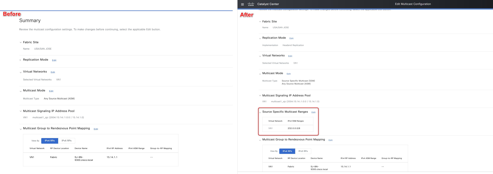
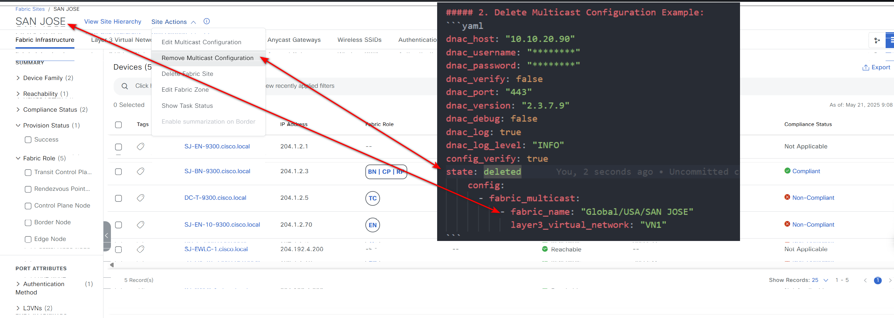

# Ansible Role: sda_fabric_multicast

This role manages SDA Fabric Multicast in Cisco Catalyst Center using the `sda_fabric_multicast_workflow_manager` module.

## Requirements

- `cisco.catalystcenter` collection installed
- Catalyst Center SDK >= 3.1.3.0.0
- Python >= 3.9

## Role Variables

### Connection Variables
- `catalystcenter_host`: Catalyst Center hostname or IP address (required)
- `catalystcenter_username`: Username for authentication (required)
- `catalystcenter_password`: Password for authentication (required)
- `catalystcenter_verify`: SSL certificate verification (default: `false`)
- `catalystcenter_port`: API port (default: `443`)
- `catalystcenter_version`: Catalyst Center version (default: `2.3.7.6`)
- `catalystcenter_debug`: Enable debug mode (default: `false`)
- `catalystcenter_log_level`: Logging level (default: `INFO`)
- `catalystcenter_log`: Enable logging (default: `false`)

### Role-Specific Variables
- `sda_fabric_multicast_state`: Desired state - `merged` or `deleted` (default: `merged`)
- `sda_fabric_multicast_config_verify`: Verify configuration after applying (default: `false`)
- `sda_fabric_multicast_config`: List of SDA fabric multicast configurations (required)

## Dependencies

None

## Example Playbook

```yaml
- hosts: catalystcenter
  roles:
    - role: sda_fabric_multicast
      vars:
        catalystcenter_host: "{{ vault_catalystcenter_host }}"
        catalystcenter_username: "{{ vault_catalystcenter_username }}"
        catalystcenter_password: "{{ vault_catalystcenter_password }}"
        sda_fabric_multicast_config:
          - fabric_site_name: "Global/USA/Building1"
```

<!-- BEGIN WORKFLOW README ENHANCEMENTS -->
## Workflow Documentation Reference

These examples are adapted from the workflow documentation and example assets in `workflows/sda_fabric_multicast`.

- Source README: `workflows/sda_fabric_multicast/README.md`
- Source playbook: `workflows/sda_fabric_multicast/playbook/sda_fabric_multicast_playbook.yml`
- Source vars example: `workflows/sda_fabric_multicast/vars/sda_fabric_multicast_inputs.yml`
- Source schema: `workflows/sda_fabric_multicast/schema/sda_fabric_multicast_schema.yml`

## Visual Reference

The following image is copied from the workflow documentation to help map the role inputs to the Catalyst Center UI or expected output.



## Adapted Examples

### Example 1: Fabric Multicast

```yaml
- hosts: localhost
  roles:
    - role: sda_fabric_multicast
      vars:
        catalystcenter_host: "{{ vault_catalystcenter_host }}"
        catalystcenter_username: "{{ vault_catalystcenter_username }}"
        catalystcenter_password: "{{ vault_catalystcenter_password }}"
        sda_fabric_multicast_state: "merged"
        sda_fabric_multicast_config:
        - fabric_multicast:
          - fabric_name: Global/USA/SAN JOSE
            layer3_virtual_network: Employee_VN
            replication_mode: HEADEND_REPLICATION
            ip_pool_name: MULTICASTPOOL_sjc
            asm:
            - rp_device_location: EXTERNAL
              ex_rp_ipv4_address: 204.192.3.40
              is_default_v4_rp: true
            - rp_device_location: EXTERNAL
              ex_rp_ipv6_address: 2004:192:3:40::1
              is_default_v6_rp: true
          - fabric_name: Global/USA/SAN JOSE
            layer3_virtual_network: Mgmt_VN
            replication_mode: HEADEND_REPLICATION
            ip_pool_name: MULTICASTPOOL1_sjc
            ssm:
              ipv4_ssm_ranges:
              - 234.0.0.0/8
        - fabric_multicast:
          - fabric_name: Global/USA/SAN-FRANCISCO
            layer3_virtual_network: Employee_VN
            replication_mode: HEADEND_REPLICATION
            ip_pool_name: MULTICASTPOOL_sf
            asm:
            - rp_device_location: EXTERNAL
              ex_rp_ipv4_address: 204.192.3.40
              ipv4_asm_ranges:
              - 234.0.0.0/8
            - rp_device_location: EXTERNAL
              ex_rp_ipv6_address: 2004:192:3:40::1
              ipv6_asm_ranges:
              - FF03::/64
          - fabric_name: Global/USA/SAN-FRANCISCO
            layer3_virtual_network: Mgmt_VN
            replication_mode: HEADEND_REPLICATION
            ip_pool_name: MULTICASTPOOL1_sf
            ssm:
              ipv4_ssm_ranges:
              - 234.0.0.0/8
```

<!-- END WORKFLOW README ENHANCEMENTS -->

## License

GPL-3.0-or-later

## Author Information

Cisco Systems
