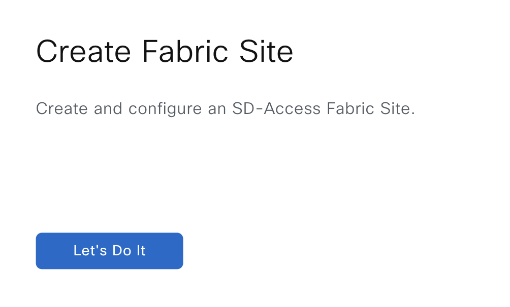
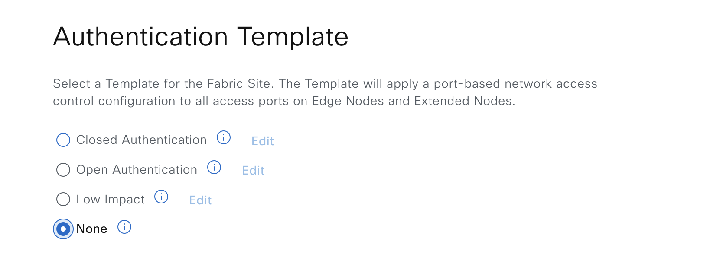

# Ansible Role: sda_fabric_sites_zones

This role manages SDA Fabric Sites and Zones in Cisco Catalyst Center using the `sda_fabric_sites_zones_workflow_manager` module.

## Requirements

- `cisco.catalystcenter` collection installed
- Catalyst Center SDK >= 3.1.3.0.0
- Python >= 3.9

## Role Variables

### Connection Variables
- `catalystcenter_host`: Catalyst Center hostname or IP address (required)
- `catalystcenter_username`: Username for authentication (required)
- `catalystcenter_password`: Password for authentication (required)
- `catalystcenter_verify`: SSL certificate verification (default: `false`)
- `catalystcenter_port`: API port (default: `443`)
- `catalystcenter_version`: Catalyst Center version (default: `2.3.7.6`)
- `catalystcenter_debug`: Enable debug mode (default: `false`)
- `catalystcenter_log_level`: Logging level (default: `INFO`)
- `catalystcenter_log`: Enable logging (default: `false`)

### Role-Specific Variables
- `sda_fabric_sites_zones_state`: Desired state - `merged` or `deleted` (default: `merged`)
- `sda_fabric_sites_zones_config_verify`: Verify configuration after applying (default: `false`)
- `sda_fabric_sites_zones_config`: List of SDA fabric sites and zones configurations (required)

## Dependencies

None

## Example Playbook

```yaml
- hosts: catalystcenter
  roles:
    - role: sda_fabric_sites_zones
      vars:
        catalystcenter_host: "{{ vault_catalystcenter_host }}"
        catalystcenter_username: "{{ vault_catalystcenter_username }}"
        catalystcenter_password: "{{ vault_catalystcenter_password }}"
        sda_fabric_sites_zones_config:
          - fabric_site_name: "Global/USA/Building1"
```

<!-- BEGIN WORKFLOW README ENHANCEMENTS -->
## Workflow Documentation Reference

These examples are adapted from the workflow documentation and example assets in `workflows/sda_fabric_sites_zones`.

- Source README: `workflows/sda_fabric_sites_zones/README.md`
- Source playbook: `workflows/sda_fabric_sites_zones/playbook/sda_fabric_sites_zones_playbook.yml`
- Source vars example: `workflows/sda_fabric_sites_zones/vars/sda_fabric_sites_zones_inputs.yml`
- Source schema: `workflows/sda_fabric_sites_zones/schema/sda_fabric_sites_zones_schema.yml`

## Visual Reference

The following image is copied from the workflow documentation to help map the role inputs to the Catalyst Center UI or expected output.



## Adapted Examples

### Example 1: Fabric Sites And Zones

```yaml
- hosts: localhost
  roles:
    - role: sda_fabric_sites_zones
      vars:
        catalystcenter_host: "{{ vault_catalystcenter_host }}"
        catalystcenter_username: "{{ vault_catalystcenter_username }}"
        catalystcenter_password: "{{ vault_catalystcenter_password }}"
        sda_fabric_sites_zones_state: "merged"
        sda_fabric_sites_zones_config:
        - fabric_sites:
          - fabric_type: fabric_site
            site_name_hierarchy: Global/USA/SAN JOSE
            authentication_profile: No Authentication
            is_pub_sub_enabled: true
            apply_pending_events: true
          - fabric_type: fabric_site
            site_name_hierarchy: Global/USA/SAN-FRANCISCO
            authentication_profile: Closed Authentication
            is_pub_sub_enabled: true
            update_authentication_profile:
              authentication_order: dot1x
              dot1x_fallback_timeout: 28
              wake_on_lan: true
              number_of_hosts: Single
              pre_auth_acl:
                enabled: true
                implicit_action: PERMIT
                description: low auth profile description
                access_contracts:
                - action: PERMIT
                  protocol: UDP
                  port: bootps
                - action: PERMIT
                  protocol: UDP
                  port: bootpc
                - action: PERMIT
                  protocol: UDP
                  port: domain
            apply_pending_events: true
```

<!-- END WORKFLOW README ENHANCEMENTS -->

## License

GPL-3.0-or-later

## Author Information

Cisco Systems
