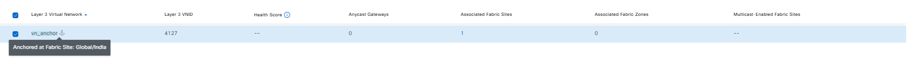
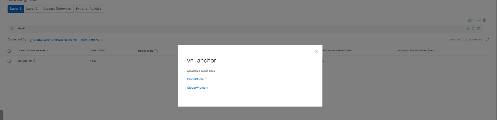

# Ansible Role: sda_fabric_virtual_networks

This role manages SDA Fabric Virtual Networks in Cisco Catalyst Center using the `sda_fabric_virtual_networks_workflow_manager` module.

## Requirements

- `cisco.catalystcenter` collection installed
- Catalyst Center SDK >= 3.1.3.0.0
- Python >= 3.9

## Role Variables

### Connection Variables
- `catalystcenter_host`: Catalyst Center hostname or IP address (required)
- `catalystcenter_username`: Username for authentication (required)
- `catalystcenter_password`: Password for authentication (required)
- `catalystcenter_verify`: SSL certificate verification (default: `false`)
- `catalystcenter_port`: API port (default: `443`)
- `catalystcenter_version`: Catalyst Center version (default: `2.3.7.6`)
- `catalystcenter_debug`: Enable debug mode (default: `false`)
- `catalystcenter_log_level`: Logging level (default: `INFO`)
- `catalystcenter_log`: Enable logging (default: `false`)

### Role-Specific Variables
- `sda_fabric_virtual_networks_state`: Desired state - `merged` or `deleted` (default: `merged`)
- `sda_fabric_virtual_networks_config_verify`: Verify configuration after applying (default: `false`)
- `sda_fabric_virtual_networks_sda_fabric_vlan_limit`: Maximum number of fabric VLANs processed per API batch (default: `20`)
- `sda_fabric_virtual_networks_sda_fabric_gateway_limit`: Maximum number of anycast gateways processed per API batch (default: `20`)
- `sda_fabric_virtual_networks_config`: List of SDA fabric virtual networks configurations (required)

## Dependencies

None

## Example Playbook

```yaml
- hosts: catalystcenter
  roles:
    - role: sda_fabric_virtual_networks
      vars:
        catalystcenter_host: "{{ vault_catalystcenter_host }}"
        catalystcenter_username: "{{ vault_catalystcenter_username }}"
        catalystcenter_password: "{{ vault_catalystcenter_password }}"
        sda_fabric_virtual_networks_config:
          - virtual_network_name: "VN-01"
```

<!-- BEGIN WORKFLOW README ENHANCEMENTS -->
## Workflow Documentation Reference

These examples are adapted from the workflow documentation and example assets in `workflows/sda_virtual_networks_l2l3_gateways`.

- Source README: `workflows/sda_virtual_networks_l2l3_gateways/README.md`
- Source playbook: `workflows/sda_virtual_networks_l2l3_gateways/playbook/sda_virtual_networks_l2_l3_gateways_playbook.yml`
- Source vars example: `workflows/sda_virtual_networks_l2l3_gateways/vars/sda_virtual_networks_l2_l3_gateways_input.yml`
- Source schema: `workflows/sda_virtual_networks_l2l3_gateways/schema/sda_virtual_networks_l2_l3_gateways_schema.yml`

## Visual Reference

The following image is copied from the workflow documentation to help map the role inputs to the Catalyst Center UI or expected output.



## Adapted Examples

### Example 1: SDA Fabric Virtual Networks

```yaml
- hosts: localhost
  roles:
    - role: sda_fabric_virtual_networks
      vars:
        catalystcenter_host: "{{ vault_catalystcenter_host }}"
        catalystcenter_username: "{{ vault_catalystcenter_username }}"
        catalystcenter_password: "{{ vault_catalystcenter_password }}"
        sda_fabric_virtual_networks_state: "merged"
        sda_fabric_virtual_networks_config:
        - fabric_vlan:
          - vlan_name: vlan_test1
            fabric_site_locations:
            - site_name_hierarchy: Global/India
              fabric_type: fabric_site
            - site_name_hierarchy: Global/India/Chennai
              fabric_type: fabric_zone
            vlan_id: 1333
            traffic_type: DATA
        - virtual_networks:
          - vn_name: vn_with_anchor
            fabric_site_locations:
            - site_name_hierarchy: Global/India
              fabric_type: fabric_site
            anchored_site_name: Global/India
```

<!-- END WORKFLOW README ENHANCEMENTS -->

## License

GPL-3.0-or-later

## Author Information

Cisco Systems
