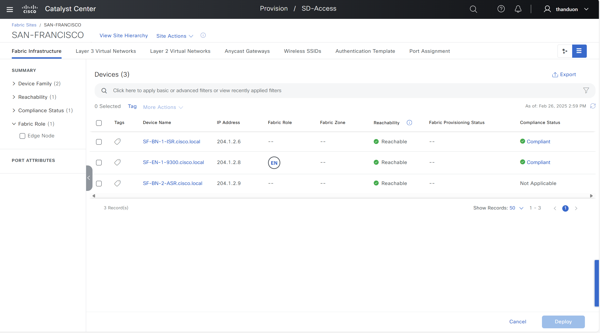
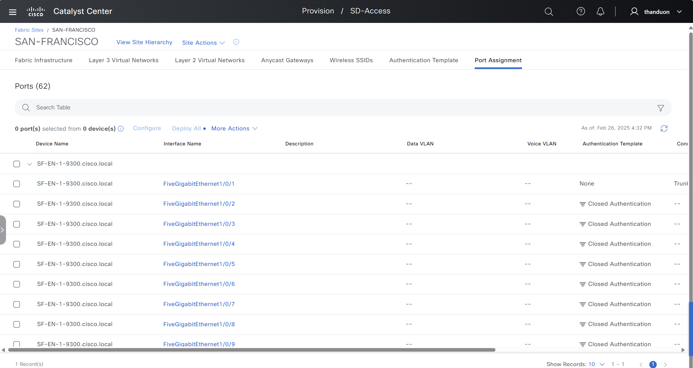

# Ansible Role: sda_host_port_onboarding

This role manages SDA Host Port Onboarding in Cisco Catalyst Center using the `sda_host_port_onboarding_workflow_manager` module.

## Requirements

- `cisco.catalystcenter` collection installed
- Catalyst Center SDK >= 3.1.3.0.0
- Python >= 3.9

## Role Variables

### Connection Variables
- `catalystcenter_host`: Catalyst Center hostname or IP address (required)
- `catalystcenter_username`: Username for authentication (required)
- `catalystcenter_password`: Password for authentication (required)
- `catalystcenter_verify`: SSL certificate verification (default: `false`)
- `catalystcenter_port`: API port (default: `443`)
- `catalystcenter_version`: Catalyst Center version (default: `2.3.7.6`)
- `catalystcenter_debug`: Enable debug mode (default: `false`)
- `catalystcenter_log_level`: Logging level (default: `INFO`)
- `catalystcenter_log`: Enable logging (default: `false`)

### Role-Specific Variables
- `sda_host_port_onboarding_state`: Desired state - `merged` or `deleted` (default: `merged`)
- `sda_host_port_onboarding_config_verify`: Verify configuration after applying (default: `false`)
- `sda_host_port_onboarding_sda_fabric_port_channel_limit`: Maximum number of port channels processed in a single API batch (default: `20`)
- `sda_host_port_onboarding_config`: List of SDA host port onboarding configurations (required)

## Dependencies

None

## Example Playbook

```yaml
- hosts: catalystcenter
  roles:
    - role: sda_host_port_onboarding
      vars:
        catalystcenter_host: "{{ vault_catalystcenter_host }}"
        catalystcenter_username: "{{ vault_catalystcenter_username }}"
        catalystcenter_password: "{{ vault_catalystcenter_password }}"
        sda_host_port_onboarding_config:
          - fabric_site_name: "Global/USA/Building1"
```

<!-- BEGIN WORKFLOW README ENHANCEMENTS -->
## Workflow Documentation Reference

These examples are adapted from the workflow documentation and example assets in `workflows/sda_hostonboarding`.

- Source README: `workflows/sda_hostonboarding/README.md`
- Source playbook: `workflows/sda_hostonboarding/playbook/sda_host_onboarding_playbook.yml`
- Source vars example: `workflows/sda_hostonboarding/vars/sda_host_onboarding_input.yml`
- Source schema: `workflows/sda_hostonboarding/schema/sda_host_onboarding_schema.yml`

## Visual Reference

The following image is copied from the workflow documentation to help map the role inputs to the Catalyst Center UI or expected output.



## Adapted Examples

### Example 1: SDA Host Onboarding

```yaml
- hosts: localhost
  roles:
    - role: sda_host_port_onboarding
      vars:
        catalystcenter_host: "{{ vault_catalystcenter_host }}"
        catalystcenter_username: "{{ vault_catalystcenter_username }}"
        catalystcenter_password: "{{ vault_catalystcenter_password }}"
        sda_host_port_onboarding_state: "merged"
        sda_host_port_onboarding_config:
        - ip_address: 204.101.16.1
          fabric_site_name_hierarchy: Global/USA/SAN JOSE
          port_assignments:
          - interface_name: GigabitEthernet6/0/13
            connected_device_type: TRUNKING_DEVICE
          - interface_name: GigabitEthernet6/0/14
            connected_device_type: TRUNKING_DEVICE
            authentication_template_name: No Authentication
            interface_description: Trunk Port
          port_channels:
          - interface_names:
            - GigabitEthernet6/0/18
            - GigabitEthernet6/0/19
            connected_device_type: TRUNK
          - interface_names:
            - GigabitEthernet6/0/20
            - GigabitEthernet6/0/21
            - GigabitEthernet6/0/22
            connected_device_type: TRUNK
            protocol: PAGP
          wireless_ssids:
          - vlan_name: EMPLOYEEPOOL_sjc_Employee_VN
            ssid_details:
            - ssid_name: employees
              security_group_name: Employees
          - vlan_name: GUESTPOOL_sjc_Guest_VN
            ssid_details:
            - ssid_name: guest-nw
              security_group_name: Guests
        - fabric_site_name_hierarchy: Global/USA/SAN-FRANCISCO
          ip_address: 204.101.16.2
          port_assignments:
          - interface_name: GigabitEthernet1/0/4
            connected_device_type: TRUNKING_DEVICE
          - interface_name: GigabitEthernet1/0/5
            connected_device_type: TRUNKING_DEVICE
            interface_description: Trunk Port
          port_channels:
          - interface_names:
            - GigabitEthernet1/0/11
            - GigabitEthernet1/0/12
            connected_device_type: TRUNK
          - interface_names:
            - GigabitEthernet1/0/13
            - GigabitEthernet1/0/14
            - GigabitEthernet1/0/15
            connected_device_type: TRUNK
            protocol: PAGP
```

<!-- END WORKFLOW README ENHANCEMENTS -->

## License

GPL-3.0-or-later

## Author Information

Cisco Systems
