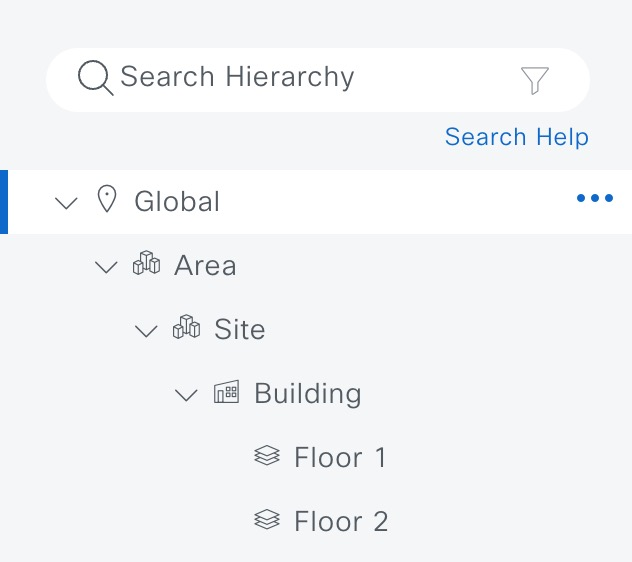
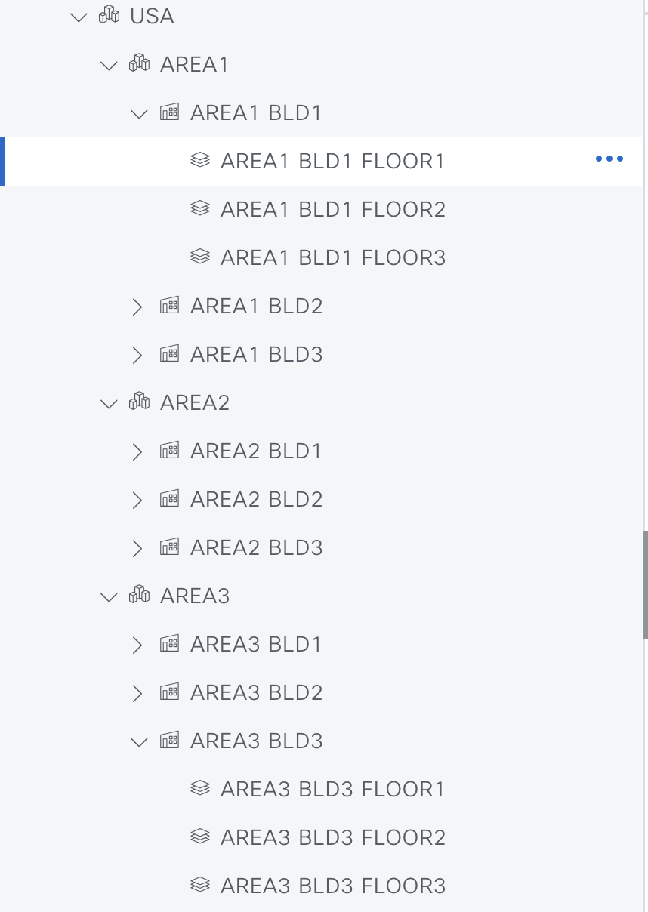

# Ansible Role: site

This role manages Sites in Cisco Catalyst Center using the `site_workflow_manager` module.

## Requirements

- `cisco.catalystcenter` collection installed
- Catalyst Center SDK >= 3.1.3.0.0
- Python >= 3.9

## Role Variables

### Connection Variables
- `catalystcenter_host`: Catalyst Center hostname or IP address (required)
- `catalystcenter_username`: Username for authentication (required)
- `catalystcenter_password`: Password for authentication (required)
- `catalystcenter_verify`: SSL certificate verification (default: `false`)
- `catalystcenter_port`: API port (default: `443`)
- `catalystcenter_version`: Catalyst Center version (default: `2.3.7.6`)
- `catalystcenter_debug`: Enable debug mode (default: `false`)
- `catalystcenter_log_level`: Logging level (default: `INFO`)
- `catalystcenter_log`: Enable logging (default: `false`)

### Role-Specific Variables
- `site_state`: Desired state - `merged` or `deleted` (default: `merged`)
- `site_config_verify`: Verify configuration after applying (default: `false`)
- `site_config`: List of site configurations (required)

## Dependencies

None

## Example Playbook

```yaml
- hosts: catalystcenter
  roles:
    - role: site
      vars:
        catalystcenter_host: "{{ vault_catalystcenter_host }}"
        catalystcenter_username: "{{ vault_catalystcenter_username }}"
        catalystcenter_password: "{{ vault_catalystcenter_password }}"
        site_config:
          - site_type: area
            site:
              area:
                name: "USA"
                parent_name: "Global"
```

<!-- BEGIN WORKFLOW README ENHANCEMENTS -->
## Workflow Documentation Reference

These examples are adapted from the workflow documentation and example assets in `workflows/site_hierarchy`.

- Source README: `workflows/site_hierarchy/README.md`
- Source playbook: `workflows/site_hierarchy/playbook/site_hierarchy_playbook.yml`
- Source vars example: `workflows/site_hierarchy/vars/site_hierarchy_design_vars.yml`
- Source schema: `workflows/site_hierarchy/schema/sites_schema.yml`

## Visual Reference

The following image is copied from the workflow documentation to help map the role inputs to the Catalyst Center UI or expected output.



## Adapted Examples

### Example 1: Design Sites

```yaml
- hosts: localhost
  roles:
    - role: site
      vars:
        catalystcenter_host: "{{ vault_catalystcenter_host }}"
        catalystcenter_username: "{{ vault_catalystcenter_username }}"
        catalystcenter_password: "{{ vault_catalystcenter_password }}"
        site_state: "merged"
        site_config:
        - site:
            area:
              name: USA
              parent_name: Global
          type: area
        - site:
            area:
              name: SAN JOSE
              parent_name: Global/USA
          type: area
```

<!-- END WORKFLOW README ENHANCEMENTS -->

## License

GPL-3.0-or-later

## Author Information

Cisco Systems
