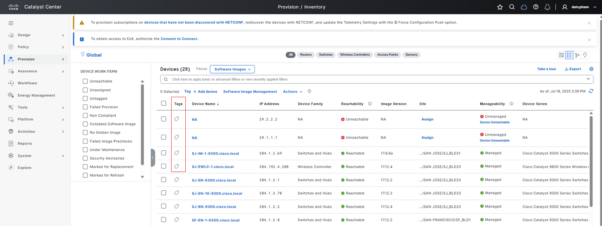
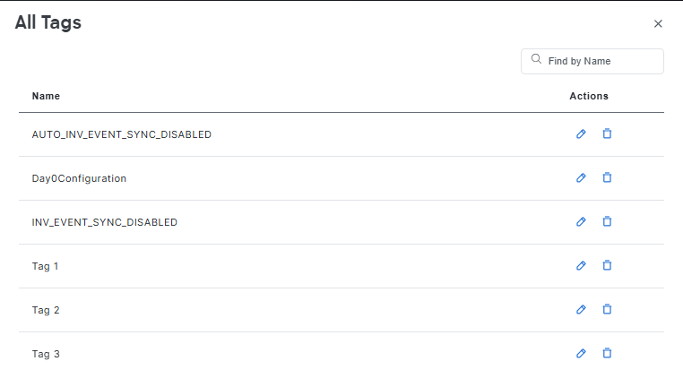

# Ansible Role: tags

This role manages Tags in Cisco Catalyst Center using the `tags_workflow_manager` module.

## Requirements

- `cisco.catalystcenter` collection installed
- Catalyst Center SDK >= 3.1.3.0.0
- Python >= 3.9

## Role Variables

### Connection Variables
- `catalystcenter_host`: Catalyst Center hostname or IP address (required)
- `catalystcenter_username`: Username for authentication (required)
- `catalystcenter_password`: Password for authentication (required)
- `catalystcenter_verify`: SSL certificate verification (default: `false`)
- `catalystcenter_port`: API port (default: `443`)
- `catalystcenter_version`: Catalyst Center version (default: `2.3.7.6`)
- `catalystcenter_debug`: Enable debug mode (default: `false`)
- `catalystcenter_log_level`: Logging level (default: `INFO`)
- `catalystcenter_log`: Enable logging (default: `false`)

### Role-Specific Variables
- `tags_state`: Desired state - `merged` or `deleted` (default: `merged`)
- `tags_config_verify`: Verify configuration after applying (default: `false`)
- `tags_config`: List of tags configurations (required)

## Dependencies

None

## Example Playbook

```yaml
- hosts: catalystcenter
  roles:
    - role: tags
      vars:
        catalystcenter_host: "{{ vault_catalystcenter_host }}"
        catalystcenter_username: "{{ vault_catalystcenter_username }}"
        catalystcenter_password: "{{ vault_catalystcenter_password }}"
        tags_config:
          - tag_name: "Production"
```

<!-- BEGIN WORKFLOW README ENHANCEMENTS -->
## Workflow Documentation Reference

These examples are adapted from the workflow documentation and example assets in `workflows/tags_manager`.

- Source README: `workflows/tags_manager/README.md`
- Source playbook: `workflows/tags_manager/playbook/tags_manager_playbook.yml`
- Source vars example: `workflows/tags_manager/vars/tags_manager_inputs.yml`
- Source schema: `workflows/tags_manager/schema/tags_manager_schema.yml`

## Visual Reference

The following image is copied from the workflow documentation to help map the role inputs to the Catalyst Center UI or expected output.



## Adapted Examples

### Example 1: Tags

```yaml
- hosts: localhost
  roles:
    - role: tags
      vars:
        catalystcenter_host: "{{ vault_catalystcenter_host }}"
        catalystcenter_username: "{{ vault_catalystcenter_username }}"
        catalystcenter_password: "{{ vault_catalystcenter_password }}"
        tags_state: "merged"
        tags_config:
        - tag:
            name: Server_Connected_Devices_and_Ports
            description: Tag for devices and interfaces connected to servers
        - tag:
            name: Border_9400_Tag
            description: Tag for border devices belonging to the Cisco Catalyst 9400 family.
            device_rules:
              rule_descriptions:
              - rule_name: device_name
                search_pattern: contains
                value: Border
                operation: ILIKE
              - rule_name: device_series
                search_pattern: ends_with
                value: '9400'
                operation: ILIKE
```

<!-- END WORKFLOW README ENHANCEMENTS -->

## License

GPL-3.0-or-later

## Author Information

Cisco Systems
