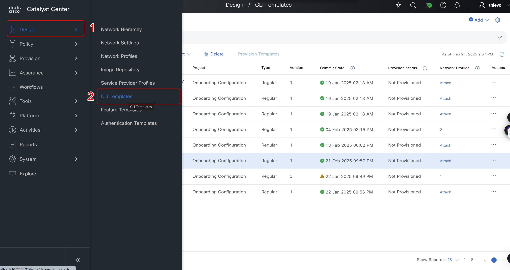
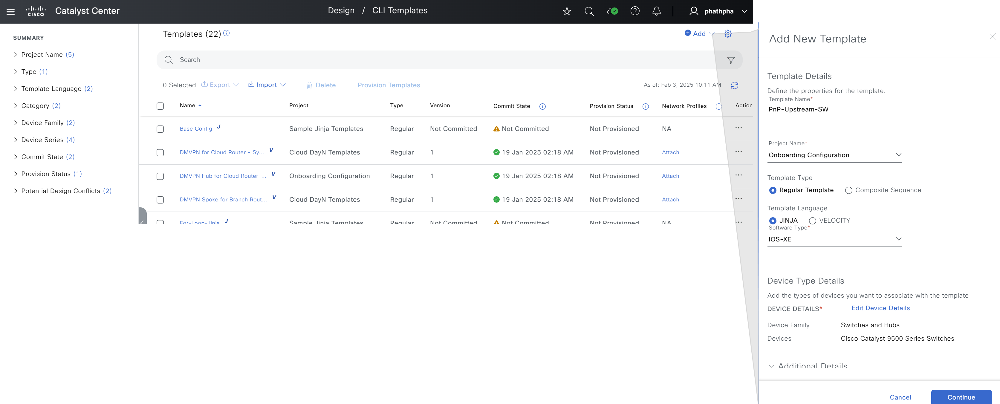

# Ansible Role: template

This role manages Templates in Cisco Catalyst Center using the `template_workflow_manager` module.

## Requirements

- `cisco.catalystcenter` collection installed
- Catalyst Center SDK >= 3.1.3.0.0
- Python >= 3.9

## Role Variables

### Connection Variables
- `catalystcenter_host`: Catalyst Center hostname or IP address (required)
- `catalystcenter_username`: Username for authentication (required)
- `catalystcenter_password`: Password for authentication (required)
- `catalystcenter_verify`: SSL certificate verification (default: `false`)
- `catalystcenter_port`: API port (default: `443`)
- `catalystcenter_version`: Catalyst Center version (default: `2.3.7.6`)
- `catalystcenter_debug`: Enable debug mode (default: `false`)
- `catalystcenter_log_level`: Logging level (default: `INFO`)
- `catalystcenter_log`: Enable logging (default: `false`)

### Role-Specific Variables
- `template_state`: Desired state - `merged` or `deleted` (default: `merged`)
- `template_config_verify`: Verify configuration after applying (default: `false`)
- `template_config`: List of template configurations (required)

## Dependencies

None

## Example Playbook

```yaml
- hosts: catalystcenter
  roles:
    - role: template
      vars:
        catalystcenter_host: "{{ vault_catalystcenter_host }}"
        catalystcenter_username: "{{ vault_catalystcenter_username }}"
        catalystcenter_password: "{{ vault_catalystcenter_password }}"
        template_config:
          - template_name: "Interface-Config-Template"
```

<!-- BEGIN WORKFLOW README ENHANCEMENTS -->
## Workflow Documentation Reference

These examples are adapted from the workflow documentation and example assets in `workflows/device_templates`.

- Source README: `workflows/device_templates/README.md`
- Source playbook: `workflows/device_templates/playbook/template_workflow_playbook.yml`
- Source vars example: `workflows/device_templates/vars/template_workflow_inputs.yml`
- Source schema: `workflows/device_templates/schema/template_workflow_schema.yml`

## Visual Reference

The following image is copied from the workflow documentation to help map the role inputs to the Catalyst Center UI or expected output.



## Adapted Examples

### Example 1: Template

```yaml
- hosts: localhost
  roles:
    - role: template
      vars:
        catalystcenter_host: "{{ vault_catalystcenter_host }}"
        catalystcenter_username: "{{ vault_catalystcenter_username }}"
        catalystcenter_password: "{{ vault_catalystcenter_password }}"
        template_state: "merged"
        template_config:
        - configuration_templates:
            author: Pawan Singh
            composite: false
            custom_params_order: true
            template_description: Template to configure Access Vlan n Access Interfaces
            device_types:
            - product_family: Switches and Hubs
              product_series: Cisco Catalyst 9300 Series Switches
            failure_policy: ABORT_TARGET_ON_ERROR
            language: VELOCITY
            template_name: access_van_template_9300_switches
            project_name: access_van_template_9300_switches
            project_description: This project contains all the templates for Access Switches
            software_type: IOS-XE
            software_version: null
            template_content: 'vlan $vlan

              interface $interface

              switchport access vlan $vlan

              switchport mode access

              description $interface_description

              '
            version: '1.0'
        - configuration_templates:
            template_name: PnP-Upstream-SW1
            project_name: Onboarding Configuration
            tags: []
            author: admin
            device_types:
            - product_family: Switches and Hubs
              product_series: Cisco Catalyst 9500 Series Switches
            - product_family: Switches and Hubs
              product_series: Cisco Catalyst 9300 Series Switches
            software_type: IOS-XE
            language: VELOCITY
            template_content: 'vlan $vlan

              interface $interface

              switchport access vlan $vlan

              switchport mode access

              description $interface_description

              '
```

<!-- END WORKFLOW README ENHANCEMENTS -->

## License

GPL-3.0-or-later

## Author Information

Cisco Systems
