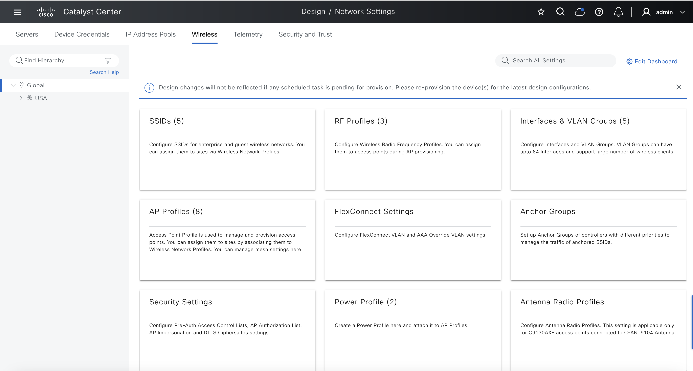
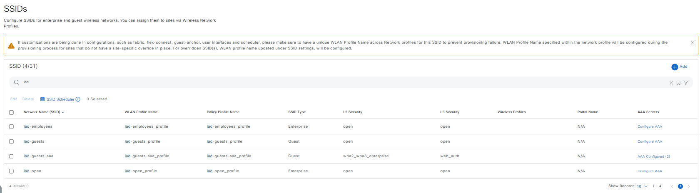

# Ansible Role: wireless_design

This role manages Wireless Design in Cisco Catalyst Center using the `wireless_design_workflow_manager` module.

## Requirements

- `cisco.catalystcenter` collection installed
- Catalyst Center SDK >= 3.1.3.0.0
- Python >= 3.9

## Role Variables

### Connection Variables
- `catalystcenter_host`: Catalyst Center hostname or IP address (required)
- `catalystcenter_username`: Username for authentication (required)
- `catalystcenter_password`: Password for authentication (required)
- `catalystcenter_verify`: SSL certificate verification (default: `false`)
- `catalystcenter_port`: API port (default: `443`)
- `catalystcenter_version`: Catalyst Center version (default: `2.3.7.6`)
- `catalystcenter_debug`: Enable debug mode (default: `false`)
- `catalystcenter_log_level`: Logging level (default: `INFO`)
- `catalystcenter_log`: Enable logging (default: `false`)

### Role-Specific Variables
- `wireless_design_state`: Desired state - `merged` or `deleted` (default: `merged`)
- `wireless_design_config_verify`: Verify configuration after applying (default: `false`)
- `wireless_design_config`: List of wireless design configurations (required)

<!-- BEGIN WORKFLOW README ENHANCEMENTS -->
## Workflow Documentation Reference

These examples are adapted from the workflow documentation and example assets in `workflows/wireless_design`.

- Source README: `workflows/wireless_design/README.md`
- Source playbook: `workflows/wireless_design/playbook/wireless_design_playbook.yml`
- Source vars example: `workflows/wireless_design/vars/wireless_design_inputs.yml`
- Source schema: `workflows/wireless_design/schema/wireless_design_schema.yml`

## Visual Reference

The following image is copied from the workflow documentation to help map the role inputs to the Catalyst Center UI or expected output.



## Adapted Examples

### Example 1: Wireless Design

```yaml
- hosts: localhost
  roles:
    - role: wireless_design
      vars:
        catalystcenter_host: "{{ vault_catalystcenter_host }}"
        catalystcenter_username: "{{ vault_catalystcenter_username }}"
        catalystcenter_password: "{{ vault_catalystcenter_password }}"
        wireless_design_state: "merged"
        wireless_design_config:
        - ssids:
          - ssid_name: iac-open
            ssid_type: Enterprise
            wlan_profile_name: iac-open_profile
            radio_policy:
              radio_bands:
              - 2.4
              - 5
              - 6
              2_dot_4_ghz_band_policy: 802.11-bg
              band_select: true
              6_ghz_client_steering: true
            fast_lane: true
            ssid_state:
              admin_status: true
              broadcast_ssid: true
            l2_security:
              l2_auth_type: OPEN
            l3_security:
              l3_auth_type: OPEN
            fast_transition: DISABLE
            aaa:
              aaa_override: false
              mac_filtering: true
              deny_rcm_clients: false
            mfp_client_protection: OPTIONAL
            protected_management_frame: REQUIRED
            11k_neighbor_list: true
            coverage_hole_detection: true
            wlan_timeouts:
              enable_session_timeout: true
              session_timeout: 3600
              enable_client_exclusion_timeout: true
              client_exclusion_timeout: 1800
            bss_transition_support:
              bss_max_idle_service: true
              bss_idle_client_timeout: 300
              directed_multicast_service: true
            nas_id:
            - AP Location
            client_rate_limit: 90000
          - ssid_name: iac-employees
            ssid_type: Enterprise
            wlan_profile_name: iac-employees_profile
            radio_policy:
              radio_bands:
              - 2.4
              - 5
              - 6
              2_dot_4_ghz_band_policy: 802.11-bg
              band_select: true
              6_ghz_client_steering: true
            fast_lane: true
            ssid_state:
              admin_status: true
              broadcast_ssid: true
            l2_security:
              l2_auth_type: OPEN
            l3_security:
              l3_auth_type: OPEN
            fast_transition: DISABLE
            aaa:
              aaa_override: false
              mac_filtering: true
              deny_rcm_clients: false
            mfp_client_protection: OPTIONAL
            protected_management_frame: REQUIRED
            11k_neighbor_list: true
            coverage_hole_detection: true
            wlan_timeouts:
              enable_session_timeout: true
              session_timeout: 3600
              enable_client_exclusion_timeout: true
              client_exclusion_timeout: 1800
            bss_transition_support:
              bss_max_idle_service: true
              bss_idle_client_timeout: 300
              directed_multicast_service: true
            nas_id:
            - AP Location
            client_rate_limit: 90000
        - interfaces:
          - interface_name: data
            vlan_id: 10
          - interface_name: voice
            vlan_id: 11
```

<!-- END WORKFLOW README ENHANCEMENTS -->

## License

GPL-3.0-or-later

## Author Information

Cisco Systems
