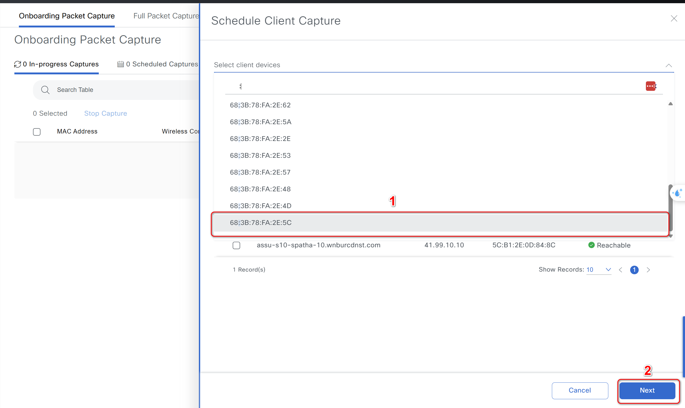
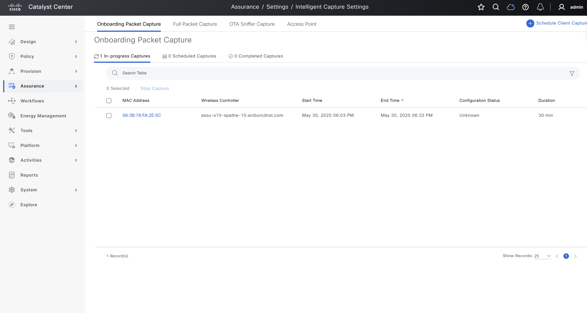

# Ansible Role: assurance_icap_settings

This role manages Assurance ICAP Settings in Cisco Catalyst Center using the `assurance_icap_settings_workflow_manager` module.

## Requirements

- `cisco.catalystcenter` collection installed
- catalystcentersdk >= 3.1.6.0.2
- Python >= 3.9
- Cisco Catalyst Center >= 2.3.7.9

## Role Variables

### Connection Variables
- `catalystcenter_host`: Catalyst Center hostname or IP address (required)
- `catalystcenter_username`: Username for authentication (required)
- `catalystcenter_password`: Password for authentication (required)
- `catalystcenter_verify`: SSL certificate verification (default: `false`)
- `catalystcenter_port`: API port (default: `443`)
- `catalystcenter_version`: Catalyst Center version (default: `2.3.7.9`)
- `catalystcenter_debug`: Enable debug mode (default: `false`)
- `catalystcenter_log_level`: Logging level (default: `INFO`)
- `catalystcenter_log`: Enable logging (default: `false`)
- `catalystcenter_log_file_path`: Log file path (default: `catalystcenter.log`)
- `catalystcenter_log_append`: Append to log file instead of overwriting (default: `true`)
- `catalystcenter_api_task_timeout`: Timeout in seconds for API task polling (default: `1200`)
- `catalystcenter_task_poll_interval`: Interval in seconds between task status polls (default: `2`)
- `validate_response_schema`: Validate API response schema (default: `true`)

### Role-Specific Variables
- `assurance_icap_settings_state`: Desired state - `merged` or `deleted` (default: `merged`)
- `assurance_icap_settings_config_verify`: Verify configuration after applying (default: `true`)
- `assurance_icap_settings_config`: List of assurance ICAP settings configurations (required)

## Dependencies

None

## Example Playbook

```yaml
- hosts: localhost
  roles:
    - role: assurance_icap_settings
      vars:
        catalystcenter_host: "{{ vault_catalystcenter_host }}"
        catalystcenter_username: "{{ vault_catalystcenter_username }}"
        catalystcenter_password: "{{ vault_catalystcenter_password }}"
        assurance_icap_settings_config:
          - assurance_icap_settings: {}
```

<!-- BEGIN WORKFLOW README ENHANCEMENTS -->
## Workflow Documentation Reference

These examples are adapted from the workflow documentation and example assets in `workflows/assurance_intelligent_capture`.

- Source README: `workflows/assurance_intelligent_capture/README.md`
- Source playbook: `workflows/assurance_intelligent_capture/playbook/assurance_intelligent_capture_playbook.yml`
- Source vars example: `workflows/assurance_intelligent_capture/vars/assurance_intelligent_capture_inputs.yml`
- Source schema: `workflows/assurance_intelligent_capture/schema/assurance_intelligent_capture_schema.yml`

## Visual Reference

The following image is copied from the workflow documentation to help map the role inputs to the Catalyst Center UI or expected output.



## Adapted Examples

### Example 1: Assurance Inteligent Capture

```yaml
- hosts: localhost
  roles:
    - role: assurance_icap_settings
      vars:
        catalystcenter_host: "{{ vault_catalystcenter_host }}"
        catalystcenter_username: "{{ vault_catalystcenter_username }}"
        catalystcenter_password: "{{ vault_catalystcenter_password }}"
        assurance_icap_settings_state: "merged"
        assurance_icap_settings_config:
        - assurance_icap_settings:
          - capture_type: ONBOARDING
            preview_description: ICAP onboarding capture
            duration_in_mins: 30
            client_mac: 50:91:E3:47:AC:9E
            wlc_name: NY-IAC-EWLC.cisco.local
          - capture_type: FULL
            preview_description: Full ICAP capture for troubleshooting
            duration_in_mins: 30
            client_mac: 50:91:E3:47:AC:9E
            wlc_name: NY-IAC-EWLC.cisco.local
        - assurance_icap_download:
          - capture_type: FULL
            client_mac: 50:91:E3:47:AC:9E
            start_time: '2025-03-05 11:56:00'
            end_time: '2025-03-05 12:01:00'
            file_path: ./
```

<!-- END WORKFLOW README ENHANCEMENTS -->

## License

GPL-3.0-or-later

## Author Information

Cisco Systems
