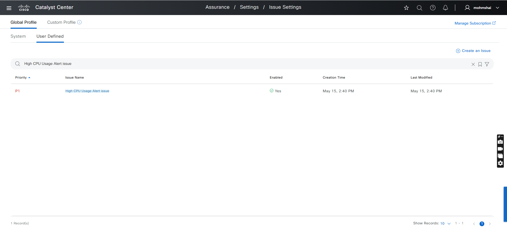
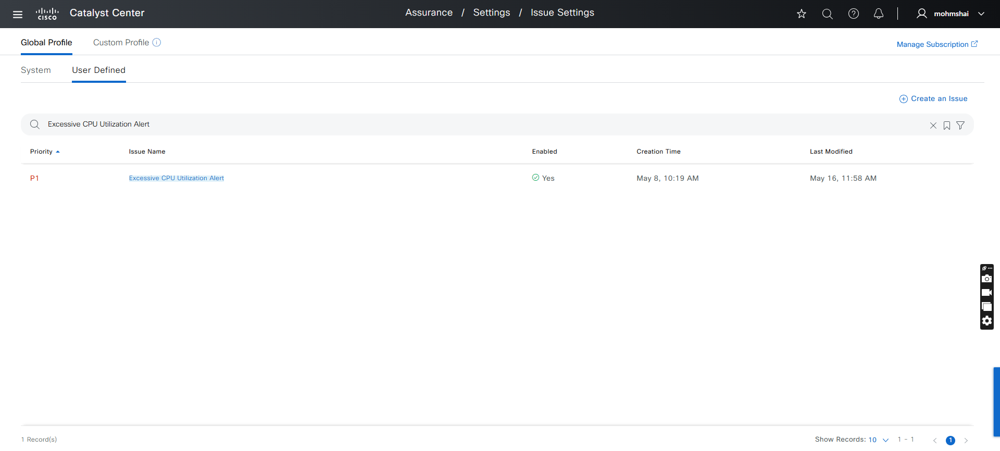

# Ansible Role: assurance_issue

This role manages Assurance Issues in Cisco Catalyst Center using the `assurance_issue_workflow_manager` module.

## Requirements

- `cisco.catalystcenter` collection installed
- catalystcentersdk >= 3.1.6.0.2
- Python >= 3.9

## Role Variables

### Connection Variables
- `catalystcenter_host`: Catalyst Center hostname or IP address (required)
- `catalystcenter_username`: Username for authentication (required)
- `catalystcenter_password`: Password for authentication (required)
- `catalystcenter_verify`: SSL certificate verification (default: `false`)
- `catalystcenter_port`: API port (default: `443`)
- `catalystcenter_version`: Catalyst Center version (default: `2.3.7.9`)
- `catalystcenter_debug`: Enable debug mode (default: `false`)
- `catalystcenter_log_level`: Logging level (default: `INFO`)
- `catalystcenter_log`: Enable logging (default: `false`)
- `catalystcenter_log_file_path`: Log file path (default: `catalystcenter.log`)
- `catalystcenter_log_append`: Append to log file instead of overwriting (default: `true`)
- `catalystcenter_api_task_timeout`: Timeout in seconds for API task polling (default: `1200`)
- `catalystcenter_task_poll_interval`: Interval in seconds between task status polls (default: `2`)
- `validate_response_schema`: Validate API response schema (default: `true`)

### Role-Specific Variables
- `assurance_issue_state`: Desired state - `merged` or `deleted` (default: `merged`)
- `assurance_issue_config_verify`: Verify configuration after applying (default: `false`)
- `assurance_issue_config`: List of assurance issue configurations (required)

## Dependencies

None

## Example Playbook

```yaml
- hosts: localhost
  roles:
    - role: assurance_issue
      vars:
        catalystcenter_host: "{{ vault_catalystcenter_host }}"
        catalystcenter_username: "{{ vault_catalystcenter_username }}"
        catalystcenter_password: "{{ vault_catalystcenter_password }}"
        assurance_issue_config:
          - assurance_issue: {}
```

<!-- BEGIN WORKFLOW README ENHANCEMENTS -->
## Workflow Documentation Reference

These examples are adapted from the workflow documentation and example assets in `workflows/assurance_issues_management`.

- Source README: `workflows/assurance_issues_management/README.md`
- Source playbook: `workflows/assurance_issues_management/playbook/assurance_issues_management_playbook.yml`
- Source vars example: `workflows/assurance_issues_management/vars/assurance_issues_management_inputs.yml`
- Source schema: `workflows/assurance_issues_management/schema/assurance_issues_management_schema.yml`

## Visual Reference

The following image is copied from the workflow documentation to help map the role inputs to the Catalyst Center UI or expected output.



## Adapted Examples

### Example 1: Assurance Issues

```yaml
- hosts: localhost
  roles:
    - role: assurance_issue
      vars:
        catalystcenter_host: "{{ vault_catalystcenter_host }}"
        catalystcenter_username: "{{ vault_catalystcenter_username }}"
        catalystcenter_password: "{{ vault_catalystcenter_password }}"
        assurance_issue_state: "merged"
        assurance_issue_config:
        - assurance_user_defined_issue_settings:
          - name: High CPU Usage Alert issue
            description: Triggers an alert when CPU usage exceeds threshold
            rules:
            - severity: Warning
              facility: LISP
              mnemonic: MAP_CACHE_WARNING_THRESHOLD_REACHED
              pattern: The LISP map-cache limit warning threshold * entries for instance-id * has been reached.
              occurrences: 1
              duration_in_minutes: 2
            is_enabled: true
            priority: P1
            is_notification_enabled: false
        - assurance_user_defined_issue_settings:
          - prev_name: High CPU Usage Alert issue
            name: Excessive CPU Utilization Alert
            description: Triggers an alert when CPU usage exceeds threshold
            rules:
            - severity: Warning
              facility: LISP
              mnemonic: MAP_CACHE_WARNING_THRESHOLD_REACHED
              pattern: The LISP map-cache limit warning threshold * entries for instance-id * has been reac.
              occurrences: 1
              duration_in_minutes: 3
            is_enabled: true
            priority: P1
            is_notification_enabled: false
```

<!-- END WORKFLOW README ENHANCEMENTS -->

## License

GPL-3.0-or-later

## Author Information

Cisco Systems
