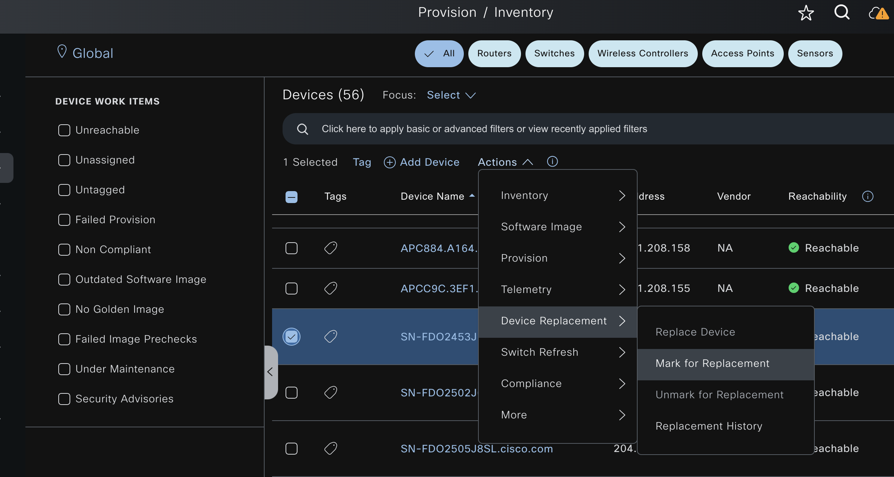
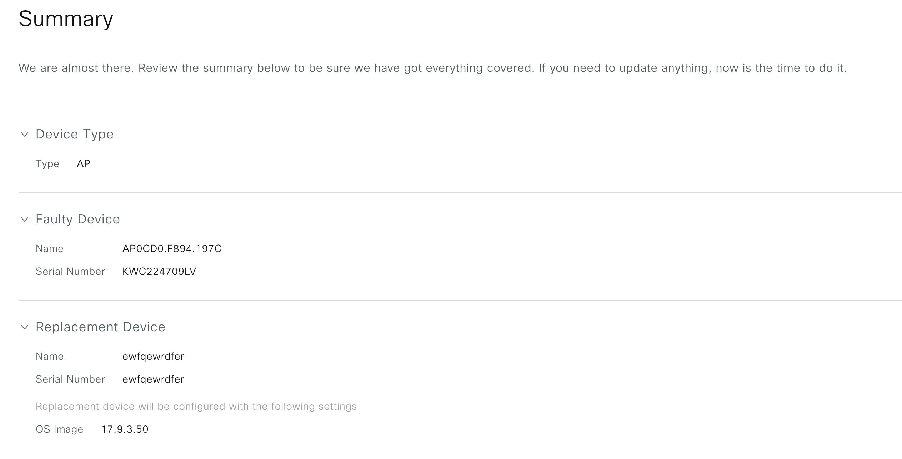

# Ansible Role: rma

This role manages RMA (Return Merchandise Authorization) in Cisco Catalyst Center using the `rma_workflow_manager` module.

## Requirements

- `cisco.catalystcenter` collection installed
- catalystcentersdk >= 3.1.6.0.2
- Python >= 3.9
- Cisco Catalyst Center >= 2.3.5.3

## Role Variables

### Connection Variables
- `catalystcenter_host`: Catalyst Center hostname or IP address (required)
- `catalystcenter_username`: Username for authentication (required)
- `catalystcenter_password`: Password for authentication (required)
- `catalystcenter_verify`: SSL certificate verification (default: `false`)
- `catalystcenter_port`: API port (default: `443`)
- `catalystcenter_version`: Catalyst Center version (default: `2.3.7.9`)
- `catalystcenter_debug`: Enable debug mode (default: `false`)
- `catalystcenter_log_level`: Logging level (default: `INFO`)
- `catalystcenter_log`: Enable logging (default: `false`)
- `catalystcenter_log_file_path`: Log file path (default: `catalystcenter.log`)
- `catalystcenter_log_append`: Append to log file instead of overwriting (default: `true`)
- `catalystcenter_api_task_timeout`: Timeout in seconds for API task polling (default: `1200`)
- `catalystcenter_task_poll_interval`: Interval in seconds between task status polls (default: `2`)
- `validate_response_schema`: Validate API response schema (default: `true`)

### Role-Specific Variables
- `rma_state`: Desired state - `replaced` or `deleted` (default: `replaced`)
- `rma_config_verify`: Verify configuration after applying (default: `false`)
- `rma_ccc_poll_interval`: Poll interval in seconds for Catalyst Center task progress checks (default: `2`)
- `rma_resync_retry_count`: Maximum number of resynchronization retries during replacement workflow execution (default: `1000`)
- `rma_resync_retry_interval`: Delay in seconds between resynchronization retries (default: `30`)
- `rma_timeout_interval`: Operation timeout in seconds for replacement workflow actions (default: `100`)
- `rma_config`: List of RMA configurations (required)

## Dependencies

None

## Example Playbook

```yaml
- hosts: localhost
  roles:
    - role: rma
      vars:
        catalystcenter_host: "{{ vault_catalystcenter_host }}"
        catalystcenter_username: "{{ vault_catalystcenter_username }}"
        catalystcenter_password: "{{ vault_catalystcenter_password }}"
        rma_state: "replaced"
        rma_config:
          - faulty_device_serial_number: "FCW1234ABCD"
            replacement_device_serial_number: "FCW5678EFGH"
```

<!-- BEGIN WORKFLOW README ENHANCEMENTS -->
## Workflow Documentation Reference

These examples are adapted from the workflow documentation and example assets in `workflows/device_replacement_rma`.

- Source README: `workflows/device_replacement_rma/README.md`
- Source playbook: `workflows/device_replacement_rma/playbook/device_replacement_rma_playbook.yml`
- Source vars example: `workflows/device_replacement_rma/vars/device_replacement_rma_input.yml`
- Source schema: `workflows/device_replacement_rma/schema/device_replacement_rma_schema.yml`

## Visual Reference

The following image is copied from the workflow documentation to help map the role inputs to the Catalyst Center UI or expected output.



## Adapted Examples

### Example 1: RMA Devices

```yaml
- hosts: localhost
  roles:
    - role: rma
      vars:
        catalystcenter_host: "{{ vault_catalystcenter_host }}"
        catalystcenter_username: "{{ vault_catalystcenter_username }}"
        catalystcenter_password: "{{ vault_catalystcenter_password }}"
        rma_state: "replaced"
        rma_config:
        - faulty_device_serial_number: KWC224709LV
          replacement_device_serial_number: KWC2333037V
```

<!-- END WORKFLOW README ENHANCEMENTS -->

## License

GPL-3.0-or-later

## Author Information

Cisco Systems
